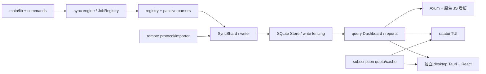

# llmusage 常青审查报告

审查日期2026-09-07；基线dev / d34dd69a0c3f5db563475a05ead2b83b9e181eba。用户授权读取、测试、根因追踪与Trellis父子计划；未授权实施、提交、推送、全局配置、生产/真实用户数据操作。

结论：现有常规测试通过，但发现一项已动态复现的数据丢失缺陷、一个重复失败的发布门禁及测试/工具规则覆盖缺口。建议先实施P1，P2单独批准。没有根据文件长度发起大规模重构。

## 项目结构与真实边界

src/main.rs调用lib::run；src/sync拥有调度，commands是外层适配；parsers按registry被动读取客户端产物，不能把llmusage支持某source等同该harness能自动加载项目规则。Store负责shard事务、游标、来源文件状态、全局/host数据；query已有按域拆分，架构AST测试覆盖禁止反向依赖。desktop是独立Cargo.toml，root autotests=false通过8个target显式纳入tests/<domain>。文档为VitePress双语。

已读AGENTS/CLAUDE、Cargo/lock/toolchain/justfile、CI脚本/workflow、src/lib/main、sync engine/driver、writer/schema、query/snapshot、remote协议/importer、subscription/cache、desktop runtime及相关测试；领域入口docs/agents/domain.md和相关ADR。CONTEXT.md不存在，按领域入口约定不把其缺失列为改造项。

## 发现与优先级

| ID | 优先级/证据 | 问题与最小建议 | 子任务 |
| --- | --- | --- | --- |
| F1 | P1 / 动态复现 | 普通sync解析前先清空legacy来源；解析失败或取消不会恢复。停止隐式破坏性重建，保留历史并提示显式修复 | evergreen-safe-automatic-repair |
| F2 | P1 / 三次CI实证+实时基线 | semver-checks不支持--locked；默认crates.io同名项目错误；PR又跳过。使用本项目release git基线并使检查可达 | evergreen-semver-workflow |
| F3 | P1 / 代码清单+实跑 | CSV测试与独立desktop未纳入统一门禁；just ci还自动改锁。统一测试入口，加入desktop job，验证不改锁 | evergreen-test-gates |
| F4 | P1/P2 / 本地探针+官方文档 | Codex子目录hook路径失败、Kimi角色自动发现路径漂移、共享说明过时、无可靠便宜执行分层 | evergreen-harness-contracts |
| F5 | P2 / 源码机制，未动态复现 | 单连接并非单读快照；复合指标可能跨commit。短只读事务+barrier回归 | evergreen-snapshot-consistency |
| F6 | P2 / 源码机制，未动态复现 | desktop按mtime猜cache_hit，实际按JSON fetched_at。由subscription真实读取分支返回来源 | evergreen-quota-provenance |
| F7 | P2 / 源码机制，未动态复现 | 远程同wire不同accounting口径仍可导入，local marker遮蔽remote状态。入口校验每源版本+host/source事实 | evergreen-remote-accounting |

### F1：数据保留不变量缺失

src/sync/engine.rs:228-265在driver之前reset；:289-313出错即返回；src/store/schema.rs:298-318、:393-433的删除事务已提交。tests/sync/accounting.rs:690-790只查marker/error，故绿测无法证明历史保留。探针 parser failure 的 event/bucket/turn/cursor/status 从1变0；cancel路径source_file也1变0。见[隔离复现](repro-accounting/result.md)。这是测试覆盖缺口，不是只凭推测的数据风险。

建议的行为变化必须由用户批准：普通sync跳过legacy写入、serve继续呈现旧历史和warning；显式rebuild仍由用户主动请求。源级staging是更大替代方案，本计划不混入。

### F2：失败工作流因果链

[run 32277457654](https://github.com/bahayonghang/llmuasage/actions/runs/32277457654)：semver step报告unexpected --locked，exit2；CI gate随后正确传播arch-gate failure。另两次main相同，非Rust断言失败。

.github/workflows/ci.yml:171仅main push执行，:172仍保留错参。近期[PR run 33995753771](https://github.com/bahayonghang/llmuasage/actions/runs/33995753771)整体绿但step skipped。根规范ci-toolchain-contracts.md的所有dependency-sensitive命令加--locked应细化，第三方cargo subcommand不能机械套用。[工具官方README](https://github.com/obi1kenobi/cargo-semver-checks)区分安装与执行参数，并允许git基线。

实时crates.io API返回llmusage 0.1.4 / openrijal/llmusage（registry-baseline.json），并非bahayonghang/llmuasage。因此仅删错参还不够。已核对本项目v1.2.0 tag解析为9b7a6f3dec12764222891c2d8f5aeb42db7bd490，建议显式此基线。Cargo.toml:11的docs.rs同名文档链接也不能视作本项目API。真实semver比较尚未跑，修正后可能出现新的API差异，需单独判断而非自动加兼容层。

### F3：门禁发现范围与只读承诺

justfile:95-101与CI:119-127只列6个JS suite，漏scripts/tests/dashboard-csv-export.test.mjs的公式/转义保护测试。desktop既不是root workspace成员，也不在CI jobs中；本轮补测证明已有测试可运行，不证明CI已覆盖。justfile:90在检查前cargo update可掩盖提交的锁文件漂移，建议移到显式维护命令。

### F4：五工具规则

详见[harness-matrix.md](harness-matrix.md)。CLAUDE导入AGENTS是正确基础；Grok pull模式与OMP pi/task继承也是有效机制。不把这三点误报为缺陷。优先版本化共同规则和可执行手动fallback；被忽略Trellis模板副本的长期修复须明确上游/项目权属。

### F5–F7：证据边界

F5：src/query/mod.rs:85只承诺单连接，src/query/snapshot.rs:159/210/245多个SELECT没有显式读事务，WAL配置src/store/connection.rs:47。F6：desktop runtime.rs:61的mtime与src/subscription/cache.rs:14的fetched_at判据不同。F7：src/remote/protocol.rs:18没有每源口径，importer.rs:49忽略header且:179版本None，source_status.rs:57/107复用全局marker。

这些是可定位机制风险，不能说本次已观察真实用户错账。实施首先补确定性回归；反证成立时应撤回修复范围。

## 验证与适用工具

[Test results](test-results.md)：root Rust1086、desktop Rust29、desktop前端64、JS66全部通过；12个测量ignored；格式、clippy、rustdoc、TS、build、MSRV、安全审计及实时保护通过。五套CLI配置探针完成，真实新会话握手UNVERIFIED。未原样执行会改锁的just ci，未运行semver（本机无工具），未操作真实SSH和数据库。

每个子任务design列出准确改动文件、工具/模型分工，implement列检查。F1/F5/F7的语义/事务/协议由强模型规划和终审；F2/F3及F4的已定稿YAML/路径/链接/fixture适合较便宜模型；F6可在强模型确定公开面后委派。Kimi/Grok/OMP不因品牌而被标成低价，必须验证实际模型和账户路由。

## 批准后回写

各子任务将通过的行为写入其拥有的现有spec；harness-contracts最后将实际命令和差异写AGENTS.md与docs/agents/harness-contracts.md，逐条标适用Claude Code/Codex/Grok Build/Kimi Code/OMP。当前所有内容仅是计划。外部skill库、团队知识库或Trellis源码不在本轮默认写入范围；需要跨库时提交具体补丁范围再获授权，不复制原生记忆。
