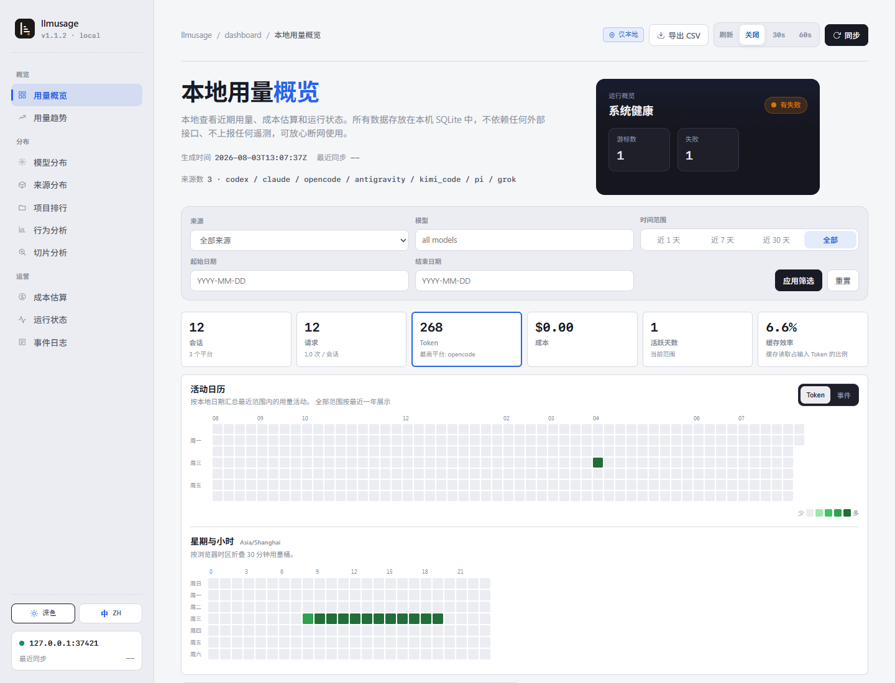

# llmusage

[简体中文](./README.zh-CN.md) · [Docs](https://bahayonghang.github.io/llmuasage/)

> **Naming note:** the crate and binary are `llmusage`; the GitHub repository is `llmuasage` (extra `a`). Links to the hosted docs use the repo spelling.

Local-first usage analytics for AI coding CLIs. `llmusage` passively reads local Codex, Claude Code, OpenCode, Kimi Code, Pi / Oh My Pi, Grok Build, ZCode, Antigravity CLI, and DeepSeek Harness artifacts into SQLite, then renders reports, terminal and browser dashboards, and offline HTML exports without upload. The `dash` Usage tab also reads already-present CLI credentials and requests provider quota APIs.

> Current crate version: `1.2.0`.



<small>Dashboard screenshot uses a sanitized local fixture served by `llmusage serve`; it is not real user data.</small>

## Install

```powershell
cargo install llmusage --git https://github.com/bahayonghang/llmuasage.git
```

For development, use `just install` from this checkout, or `cargo run` to run directly:

```powershell
just install
cargo run -- --help
```

Update an installed copy from the official repository with Cargo:

```powershell
llmusage update --check
llmusage update
llmusage update dev
```

`update` requires Git, Rust, and Cargo. The default `main` channel resolves the
highest stable release tag from the official repository, displays its tag and
commit, and installs that immutable commit with Cargo's `--rev`. The command
resolves the target again after confirmation and refuses to continue if it
changed. `llmusage update dev` displays the current commit but intentionally
follows the mutable `dev` branch and is not a verified stable release.
`--check` / `-c` contacts the official repository to resolve refs and prints the
plan, but never starts Cargo.

Top-level help is table-oriented for quick scanning. Use `llmusage help --zh` for Chinese help, and `llmusage help <COMMAND>` or `llmusage <COMMAND> --help` for command-specific clap help.

The runtime lives under `~/.llmusage/` by default. Override it with `--home <PATH>` or `LLMUSAGE_HOME`.
Structured runtime logs are local-only NDJSON shards at `~/.llmusage/logs/llmusage.ndjson.*`. Control file logging with `LLMUSAGE_LOG=off|error|warn|info|debug|trace` (default: `warn`); `RUST_LOG` continues to control console stderr logging. Shards rotate at 10 MiB while the process is running and retain at most 30 MiB, seven files, and seven days.

## Fast path

```powershell
llmusage init
llmusage sync
llmusage
llmusage serve
```

What this does:

1. `init` creates `~/.llmusage/` and bootstraps `llmusage.db`; it does not modify third-party tool configuration.
2. `sync` passively parses local sources incrementally and writes usage rows, 30-minute buckets, source-file diagnostics, and behavior facts. After the local driver it also pulls registered SSH remotes. An unbounded sync also warns and automatically rebuilds safe legacy token-accounting sources before writing new rows.
3. `llmusage` shows the default daily report for the last 7 calendar days.
4. `serve` safely rebuilds legacy parser-backed token accounting when needed, then starts the dashboard on `127.0.0.1` by default. Use `serve --public` only when you intentionally need remote access: it exposes an unauthenticated, non-TLS aggregate dashboard, but keeps project labels, logs, diagnostics, job state, and all write routes local-only.

On the first sync after an embedded pricing catalog upgrade, `sync` reprices historical events before scanning sources. Stderr reports the catalog versions, processed/total events, bucket reconciliation, and completion. `sync --json-events` exposes the same pricing lifecycle as NDJSON-only stdout.

## Supported local sources

| Source        | Local artifacts / status                                                                                                                                            |
| ------------- | ------------------------------------------------------------------------------------------------------------------------------------------------------------------- |
| Codex         | OpenAI Codex rollout/session JSONL                                                                                                                                    |
| Claude        | Claude Code project JSONL                                                                                                                                             |
| OpenCode      | OpenCode local SQLite usage database                                                                                                                                  |
| Antigravity   | `~/.gemini/antigravity-cli/conversations/*.db` (or `GEMINI_CLI_HOME`); hook-era rows stay queryable and a rebuild is refused while unattributed history exists       |
| Kimi Code     | `~/.kimi-code/sessions/**/wire.jsonl` (or `KIMI_CODE_HOME`), turn-scoped `usage.record` rows only                                                                    |
| Pi / Oh My Pi | `~/.pi/agent/sessions/**/*.jsonl` and `~/.omp/agent/sessions/**/*.jsonl` as one stable `pi` source                                                                   |
| Grok Build    | `~/.grok/sessions/*/*/` (or `GROK_HOME`), reading only the session-root `updates.jsonl`, `signals.json`, `summary.json`, and optional `events.jsonl` sidecars       |
| ZCode         | `~/.zcode/cli/db/db.sqlite` (or `ZCODE_HOME`) `model_usage` completed rows                                                                                           |
| DeepSeek Harness | `~/.dsh/sessions/**/session.jsonl.zstd` or `session.jsonl` (or `DSH_HOME`); zstd frames dispatched by magic bytes                                                 |

Kimi Code, Pi, ZCode, Antigravity CLI, and DeepSeek Harness are passive, precise sources: they keep raw model names, use source-scoped cursors for incremental/idempotent replay, and never persist transcript text. Pi support is verified with local Oh My Pi samples plus sanitized Pi-compatible fixtures; Pi-only local evidence is still limited. Grok Build is passive and `total_only`: it records authoritative session/turn totals without inventing input/output/cache splits, replays a whole session when a sidecar changes, and leaves cost `unpriced` because the local artifacts do not expose chargeable subchannels. `source-status` and `dash` also show monitor-only platform candidates such as Reasonix, Gemini CLI, Cursor, Copilot, Zed, Kiro, Goose, Kimi shell/Qwen, Roo/Kilo/Cline, Codebuff, Crush, Warp/Oz, Amp, Hermes, and Trae. Monitor-only means llmusage can probe candidate local roots and explain why parsing is blocked; it does not write zero usage rows or untrusted token rows.

Machines upgraded from a release that installed hooks or plugins should run `llmusage uninstall` once. The command removes only legacy llmusage-owned entries and wrappers while preserving historical backups and usage data; `--purge` additionally removes the runtime root.

## Common commands

```powershell
llmusage daily --source codex --since 20260501 --until 20260518
llmusage weekly --sections daily,monthly --no-cost
llmusage codex daily --since 2026-05-01 --until 2026-05-18
llmusage monthly --breakdown
llmusage session --project my-repo
llmusage blocks --active
llmusage source-status
llmusage remote add devbox user@devbox
llmusage help --zh
llmusage dash
llmusage codex-tracer
llmusage logs --limit 50 --level warn
llmusage catalog status
llmusage update --check
llmusage export html --out .\llmusage-report
```

Report commands are read-only SQLite queries; run `llmusage sync` when the database is stale.

## Reports

`daily`, `weekly`, `monthly`, and `session` use the shared coding-agent report shape. Human tables show an aggregate `All` row plus per-source `Agent` rows; CLI JSON uses camelCase fields, and `--by-agent` adds the nested source rows to JSON. `weekly` groups by the Monday that starts each week.

Report date filters accept either `YYYYMMDD` or `YYYY-MM-DD`. Use `--sections daily,weekly,monthly,session` to combine periods in one output (the requested command period stays first), and `--no-cost` to remove cost columns and JSON cost fields without changing token totals.

For a single-source view, use `llmusage <source> <period>`, for example `llmusage claude daily` or `llmusage codex monthly`. The supported source hosts are `claude`, `codex`, `opencode`, and `antigravity`; each supports `daily`, `weekly`, `monthly`, and `session`. They return the same data as `<period> --source <source>`, but remove the Agent comparison layer from text and JSON. `blocks` intentionally remains a top-level command. This uniform source surface is an llmusage extension, not a claim that every source mirrors ccusage's per-source capability matrix.

`llmusage dash` uses a tokscale-style terminal dashboard. Keyboard controls: `tab`/`shift-tab` or `1`-`9` switch views; `j`/`k`, arrows, Page Up/Page Down, Home/End, or the mouse wheel select rows; `o` cycles sortable columns and `O` reverses direction; `s` opens the source picker; `r` refreshes dashboard data; `R` toggles auto-refresh; `x` runs sync for the current source filter; `?` opens help/settings; and `q` exits.

The browser dashboard includes behavior panels and a local usage-analysis workbench for time, metric, and group-by analysis, including tool/non-tool cost attribution and offline snapshot export.

## Pricing catalog

Model pricing and context windows come from the embedded `static-v2` catalog. It includes `gpt-5.6-luna`, `gpt-5.6-terra`, and `gpt-5.6-sol` for Codex and OpenCode, including the exact `gpt-5.6` alias for Sol and request-scoped long-context pricing above 272,000 prompt tokens.

Apply a local incremental overlay without copying the embedded catalog:

```powershell
llmusage catalog apply .\pricing-overlay.json
llmusage catalog status --json
llmusage catalog reset
```

An overlay adds, replaces, or removes complete model definitions by stable model id. Applying or resetting a catalog recomputes persisted event costs and 30-minute bucket pricing. `doctor --refresh-pricing <PATH>` remains the compatibility entrypoint for a complete base snapshot, not an overlay. All catalog inputs are local files; llmusage does not fetch pricing from the network.

Pricing recompute start/reconcile/finish diagnostics are available in the local file log at `LLMUSAGE_LOG=info`; page-level records require `debug`. Human sync progress is shown independently of the file-log level, and a recompute still running after 30 seconds emits one `warn` record at the default level.

## Codex tracer

```powershell
llmusage codex-tracer
llmusage codex-tracer --port 9876
llmusage codex-tracer --no-open
llmusage codex-tracer --rebuild
```

`codex-tracer` is a Codex-only local dashboard. It reads rollout JSONL from `$CODEX_HOME/rollout/` or `~/.codex/rollout/`, builds a separate `~/.llmusage/codex-tracer.db`, and serves a dedicated browser UI with detailed token accounting and thread tracking.

## Safety defaults

- No account login, device token, upload queue, or remote usage API call. SSH remote import is a user-triggered pull of normalized fields from a host you register; it does not upload usage.
- Normal unbounded `llmusage sync` automatically rebuilds selected legacy token-accounting sources only after every target passes the lossless-rebuild preflight. If any target is unsafe, no automatic target is reset.
- Normal `llmusage sync` keeps imported usage when original source files are missing.
- `llmusage sync --recent-days N` imports only the latest UTC event window (`1..=3650`) without advancing full-history cursors; `--parallelism` accepts `1..=32`.
- A bounded sync never auto-rebuilds legacy accounting because resetting full history and importing only a time window would be lossy. Run unbounded `llmusage sync` first.
- `llmusage sync --rebuild` refuses lossy rebuilds unless you also pass `--allow-lossy-rebuild`.
- A full `llmusage sync --rebuild` resets parser-backed sources. A rebuild that would delete unattributed hook-era Antigravity rows is refused even with `--allow-lossy-rebuild`.
- `llmusage serve` also automatically rebuilds safe legacy parser sources before binding a port. Unlike the all-or-nothing normal sync preflight, serve skips only risky sources so the read-only dashboard can still start.
- Automatic repair never enables `--allow-lossy-rebuild`; use `llmusage sync --rebuild --source <source>` explicitly after restoring missing source files.
- `llmusage diagnostics --forget-file <PATH> --source <SOURCE>` is the explicit write path for intentionally ignored source files.
- `llmusage logs` queries local runtime logs and recent command audit rows without changing report stdout or `sync --json-events` stdout contracts.
- `llmusage serve --public` exposes only aggregate dashboard totals/trends/models/sources/costs plus a minimal health response. Use the default loopback listener, normally through an SSH tunnel, for projects, logs, diagnostics, jobs, behavior detail, Usage analysis, and writes.
- `llmusage catalog apply <file>` and `doctor --refresh-pricing <file>` read local catalog files; URLs are refused.

## Documentation

- [Guide](./docs/guide/getting-started.md)
- [Codex tracer guide](./docs/guide/codex-tracer.md)
- [Dashboard](./docs/dashboard/index.md)
- [CLI reference](./docs/reference/cli.md)
- [Safety](./docs/safety/index.md)
- [Architecture](./docs/architecture/index.md)

Development gate:

```powershell
just ci
```
