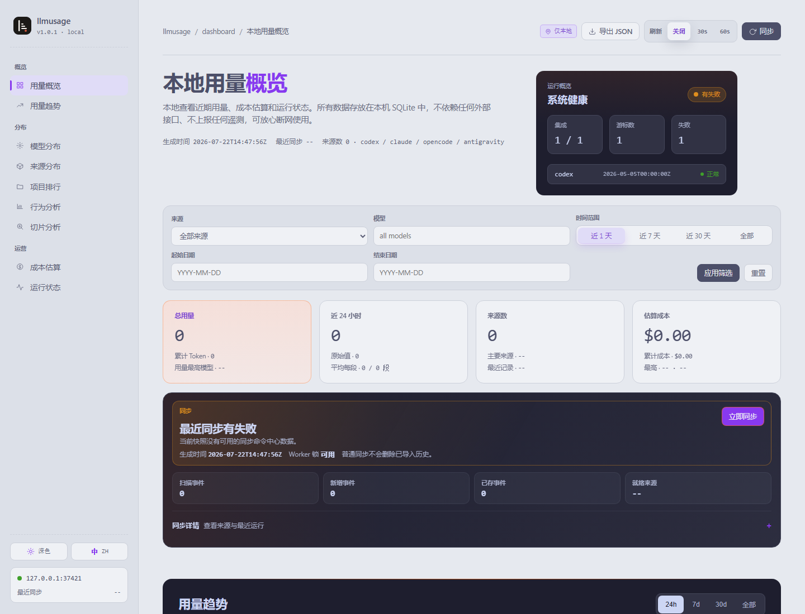

# llmusage

[English](./README.md) · [文档](https://bahayonghang.github.io/llmuasage/zh/)

本地优先的 AI CLI 用量分析工具。`llmusage` 会把本机 Codex、Claude Code、OpenCode、Google Antigravity 的本地记录解析进本地 SQLite，然后提供命令行报表、终端 Dashboard、浏览器 Dashboard 和离线 HTML 导出；不上传、不登录、不调用云端用量 API。

> 当前 crate 版本：`1.0.0`。



<small>截图来自 `llmusage serve` 启动的脱敏本地 fixture，不是真实用户数据。</small>

## 安装

```powershell
cargo install llmusage --git https://github.com/bahayonghang/llmuasage.git
```

开发时可在当前 checkout 中用 `just install` 安装，或用 `cargo run` 直接运行：

```powershell
just install
cargo run -- --help
```

顶层 help 现在使用表格形式，方便快速浏览。中文顶层 help 可用 `llmusage help --zh`；子命令旧版 clap help 仍可用 `llmusage help <COMMAND>` 或 `llmusage <COMMAND> --help`。

默认运行时目录是 `~/.llmusage/`。可用 `--home <PATH>` 或 `LLMUSAGE_HOME` 覆盖。
结构化运行日志只写本地 NDJSON：`~/.llmusage/logs/llmusage.ndjson`。文件日志可用 `LLMUSAGE_LOG=off|error|warn|info|debug|trace` 控制（默认 `warn`）；`RUST_LOG` 继续只控制控制台 stderr 日志。

## 最短路径

```powershell
llmusage init
llmusage sync
llmusage
llmusage serve
```

含义：

1. `init` 创建 `~/.llmusage/`、初始化 `llmusage.db`、写入 hook 包装器，并安装支持的本地集成。
2. `sync` 增量解析本地真源，写入 usage 行、30 分钟 bucket、source-file 诊断和行为事实。
3. `llmusage` 显示默认 daily 报表：所选时区下最近 7 个自然日。
4. `serve` 会按需安全重建旧版 parser token 统计口径，然后在 `127.0.0.1` 启动本地浏览器 Dashboard。

内置定价目录升级后的第一次 sync 会在扫描来源前重算历史事件价格。stderr 会显示目录版本、已处理/总事件数、汇总桶对账和完成状态；`sync --json-events` 会在纯 NDJSON stdout 中提供同一套定价生命周期。

## 支持的本地来源

| 来源 | 本地记录 |
| --- | --- |
| Codex | OpenAI Codex rollout/session JSONL 与 `config.toml notify` |
| Claude | Claude Code project JSONL 与 `Stop` / `SessionEnd` hooks |
| OpenCode | OpenCode 本地 SQLite 用量库与 `session.updated` plugin event |
| Antigravity | Antigravity CLI `Stop` hook（`~/.gemini/config/hooks.json`，`--source antigravity`）；没有经过验证的 token schema 前不注册 transcript parser |

`source-status` 和 `dash` 还会显示 Gemini CLI、Cursor、Copilot、Zed、Kiro、Goose、Grok、Kimi/Qwen、Roo/Kilo/Cline、Codebuff、Crush、Warp/Oz、Amp、Hermes、Trae 等仅监控平台。仅监控表示 llmusage 可以探测候选本地路径并说明为什么阻塞解析；不会写入 0 用量行，也不会写入未验证 token 行。

## 常用命令

```powershell
llmusage daily --source codex --since 20260501 --until 20260518
llmusage monthly --breakdown
llmusage session --project my-repo
llmusage blocks --active
llmusage source-status
llmusage help --zh
llmusage dash
llmusage codex-tracer
llmusage logs --limit 50 --level warn
llmusage catalog status
llmusage export html --out .\llmusage-report
```

报表命令只是只读 SQLite 查询；如果数据库过旧，先运行 `llmusage sync`。

`llmusage dash` 使用 tokscale 风格的终端 Dashboard。快捷键：`tab`/`shift-tab` 或 `1`-`9` 切换视图；`j`/`k`、方向键、Page Up/Page Down、Home/End 或鼠标滚轮选择行；`o` 循环可排序列，`O` 反转排序方向；`s` 打开来源选择器；`r` 刷新 Dashboard 数据；`R` 切换自动刷新；`x` 按当前来源筛选运行 sync；`?` 打开帮助/设置；`q` 退出。

浏览器 Dashboard 包含行为面板和本地 Cost Explorer workbench，可按时间 × 指标 × 分组做切片分析，并支持工具/非工具成本归因与离线快照导出。

## 模型价格目录

模型价格和上下文窗口来自内置 `static-v2` 目录。该目录已为 Codex 和 OpenCode 加入 `gpt-5.6-luna`、`gpt-5.6-terra`、`gpt-5.6-sol`，其中 `gpt-5.6` 是 Sol 的精确别名；单请求提示 token 超过 272,000 时使用长上下文费率。

可以只写增量覆盖，不需要复制整份内置目录：

```powershell
llmusage catalog apply .\pricing-overlay.json
llmusage catalog status --json
llmusage catalog reset
```

覆盖层按稳定模型 id 新增、完整替换或删除模型定义。apply/reset 会重算已落库 event 成本和 30 分钟 bucket 定价。`doctor --refresh-pricing <PATH>` 继续作为完整 base snapshot 的兼容入口，不是增量覆盖。所有目录输入都必须是本地文件，llmusage 不会联网拉取价格。

将 `LLMUSAGE_LOG` 设为 `info` 可在本地文件日志中记录定价重算的开始、对账和完成；页级记录需要 `debug`。终端人读进度不依赖文件日志级别；重算超过 30 秒后会按默认 `warn` 级别记录一次仍在推进的告警。

## Codex Tracer

```powershell
llmusage codex-tracer
llmusage codex-tracer --port 9876
llmusage codex-tracer --no-open
llmusage codex-tracer --rebuild
```

`codex-tracer` 是一个只面向 Codex 的本地 Dashboard。它会从 `$CODEX_HOME/rollout/` 或 `~/.codex/rollout/` 读取 rollout JSONL，构建独立的 `~/.llmusage/codex-tracer.db`，然后启动带细粒度 token 会计和线程追踪的专用浏览器界面。

## 安全默认值

- 不需要账号登录、device token、上传队列或远端用量 API。
- 普通 `llmusage sync` 遇到原始源文件缺失时会保留已导入 usage。
- `llmusage sync --rebuild` 默认拒绝有损重建，除非同时传入 `--allow-lossy-rebuild`。
- 无 source 的 `llmusage sync --rebuild` 只重置 parser-backed 来源；parserless Antigravity 的历史和诊断状态会保留。
- `llmusage serve` 会在绑定端口前自动重建可安全迁移的旧版 parser 来源。源文件缺失的来源只会告警并跳过，旧历史仍可读取且继续拒绝混写。
- 自动修复永远不会启用 `--allow-lossy-rebuild`；请先恢复缺失源文件，再显式执行 `llmusage sync --rebuild --source <source>`。
- `llmusage diagnostics --forget-file <PATH> --source <SOURCE>` 是显式忽略源文件的写入入口。
- `llmusage logs` 查询本地运行日志和最近命令审计记录，不改变报表 stdout 或 `sync --json-events` stdout 合同。
- `llmusage catalog apply <file>` 与 `doctor --refresh-pricing <file>` 只读取本地目录文件；URL 会被拒绝。

## 文档

- [指南](./docs/zh/guide/getting-started.md)
- [Codex Tracer 指南](./docs/zh/guide/codex-tracer.md)
- [Dashboard](./docs/zh/dashboard/index.md)
- [CLI 参考](./docs/zh/reference/cli.md)
- [安全说明](./docs/zh/safety/index.md)
- [架构说明](./docs/zh/architecture/index.md)

开发门禁：

```powershell
just ci
```
