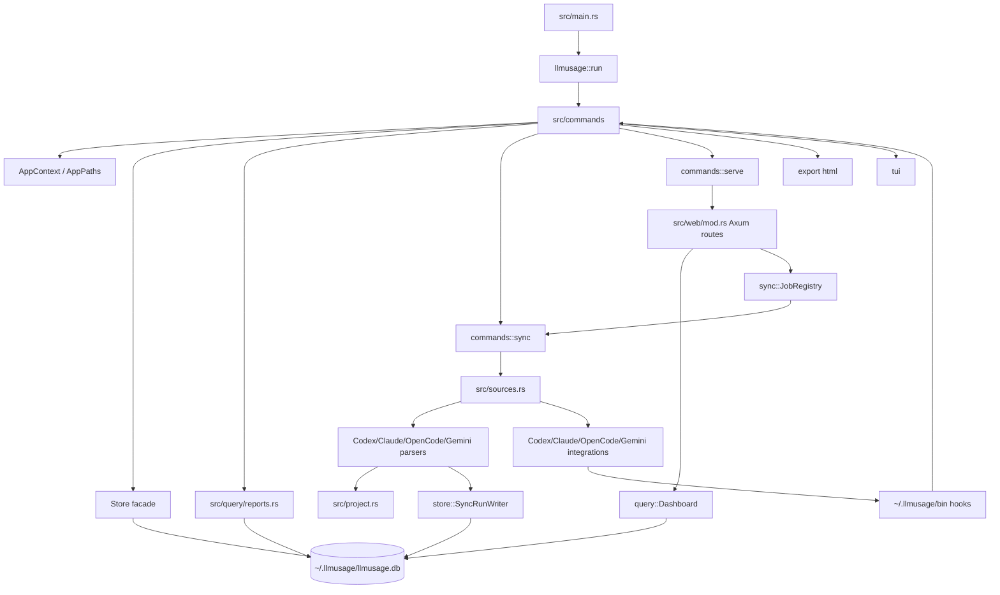

# llmusage 仓库优化建议 Canvas

> 分析对象：GitHub 可访问仓库 `bahayonghang/llmuasage`，Cargo crate/bin 名称为 `llmusage`。由于容器无法直接 `git clone`，本报告基于 GitHub connector 读取 README、Cargo.toml、justfile、核心 `src/*` 与测试文件；未运行本地测试/bench/audit。

## 0. 执行摘要（TL;DR）

**仓库概况**

- 技术栈：Rust 2024 + SQLite/rusqlite + tokio/axum + clap + ratatui + VitePress 文档。`Cargo.toml:2-4` 定义 crate/bin 为 `llmusage`、版本 `0.6.3`、edition `2024`；`Cargo.toml:24-50` 体现 axum、rusqlite、tokio、ratatui、walkdir 等核心依赖。
- 领域：local-first AI coding CLI usage analytics；通过 hooks 采集 Codex/Claude/OpenCode/Gemini 本地用量，不上传、不登录、不调用云 API。README 的定位见 `README.md:5-9`，数据目录和 SQLite 见 `README.md:18-22`。
- 规模：GitHub repo size 约 2055 KB；代码组织包含 `commands / store / parsers / query / web / integrations / sync / tui / export` 等主要模块。精确 LOC 未验证，因为运行环境无法 clone。
- 成熟度评分：**6.5 / 10**。优点是 local-first 边界清晰、SQLite schema/migration 较完整、source registry 解耦了 parser/integration、已有增量 sync 测试；主要扣分点是长 sync 锁续租缺失、rebuild 残留行为事实、shard 原子性不成立、CLI 报表 O(events) 全量读、工程化 CI/lockfile 不完整。

**最关键风险（按影响排序）**

1. **P1 数据一致性：worker lock 有 30 分钟 lease 但 sync/job 不续租**，长时间导入时第二个 worker 可在 lease 过期后接管锁，破坏单写入者假设。
2. **P1 数据正确性：`sync --rebuild`/source reset 未清理 `usage_turn`/`usage_tool_call`**，导致行为面板、Tools、Optimize、Compare 读到陈旧事实。
3. **P1 原子性：`commit_shard` 注释为“原子化提交”，实现却拆成多个事务**，cursor 可先于 raw/behavior facts 落库；中途失败会造成不可自动修复的不一致。
4. **P1 性能：CLI reports 基于 `usage_event` 读全量 Vec 后在 Rust 聚合**，没有复用 `usage_bucket_30m`；大库下内存/CPU 线性增长。
5. **P2 时间正确性：`local` timezone 使用“当前 fixed offset”处理所有历史日期**，DST 切换日和历史日期会出现过滤/分组偏移。

## 1. 问题清单

| 级别 | 维度 | 位置(file:line) | 证据 | 影响/二阶风险 | 根因 | 修复建议 | 工作量 | 信心 |
|---|---|---|---|---|---|---|---|---|
| 🟠P1 | 并发/数据一致性 | `src/store/mod.rs:34-35`, `src/store/lock.rs:19-21`, `src/commands/sync.rs:84-133`, `src/sync/job_registry.rs:213-232` | worker lock lease 固定 30 分钟；`WorkerLock::refresh()` 存在；CLI/job 只 acquire/drop，未见 sync 期间定期 refresh。 | 长 sync、慢磁盘或大历史导入超过 30 分钟时，另一 CLI/web job 可接管 expired lock，出现两个逻辑 writer、reset 与 commit 交错、cursor/bucket 不一致。 | lease 机制和长任务心跳未闭环。 | 持有 lock 后启动 heartbeat task，每 1–5 分钟或每个 shard 成功后 refresh；`Drop`/cancel 时停止；加模拟 31 分钟长任务测试。 | 0.5–1d | 高 |
| 🟠P1 | 数据正确性 | `src/store/schema.rs:103-128`, `src/store/schema.rs:131-153`, `src/store/migrations.rs:543-584`, `src/store/sync_writer.rs:513-520` | reset 只删 `usage_event`/bucket/cursor/source_file/raw，migration 创建了 `usage_turn`/`usage_tool_call`，commit 会写 turns/tool_calls。 | `sync --rebuild` 或单源 reset 后行为事实残留；`INSERT OR IGNORE` 还可能阻止修正后的事实写入，行为分析面板出现幽灵数据。 | 新增 behavior read model 后，reset 语义未同步扩展；表间无 FK cascade。 | `reset_for_source` 删除对应 source 的 `usage_turn`/`usage_tool_call`；`reset_usage_data` 全量删除两表；补 regression test：rebuild 后 orphan count=0。 | <0.5d | 高 |
| 🟠P1 | 原子性/健壮性 | `src/store/sync_writer.rs:463-533`, `src/store/sync_writer.rs:119-120`, `src/store/sync_writer.rs:283-284`, `src/store/sync_writer.rs:399-400` | `commit_shard` 注释写“原子化提交单个 shard”，但 reset/event/cursor/source_file/raw/behavior 各自开启事务；cursor 在 raw/behavior 前写。 | 任一阶段失败会留下半提交状态；最坏情况 cursor 已前进但 raw/behavior 未写，后续增量不会自动补。 | writer helper 以局部事务演进，未抽象 `Transaction` 级 unit of work。 | 改为 `commit_shard` 开一个 `transaction_with_behavior(Immediate)`，所有 helper 接收 `&Transaction`；cursor 最后写；失败整体 rollback。 | 2–4d | 高 |
| 🟠P1 | 性能/可扩展性 | `src/query/reports.rs:312-339`, `src/query/reports.rs:681-748`, `src/query/mod.rs:674-682` | daily/report 先 `load_filtered_events()` 得到 `Vec<EventRow>`，SQL 从 `usage_event` 取逐事件列；dashboard trends 已使用 `usage_bucket_30m` 聚合。 | 大库下 CLI daily/monthly/statusline/blocks 内存和 CPU 为 O(events)；statusline 高频调用会放大问题。 | CLI reports 与 dashboard query path 分裂，未共享 read model。 | daily/monthly 改用 `usage_bucket_30m` SQL 聚合；session/block 采用 keyset/streaming；project fuzzy 保留小范围后过滤或新增 searchable project label。 | 3–7d | 高 |
| 🟡P2 | 时间正确性 | `src/query/filter.rs:71-83`, `src/query/filter.rs:154-158`, `src/query/reports.rs:790-804` | `ReportTimezone::Local` 使用 `Local::now().offset().fix()`；SQL date grouping 使用固定秒 offset；历史日期也套当前 offset。 | DST 切换日、跨夏令时历史查询会错分本地日期；`since/until local` 过滤边界不准确。 | 将 timezone 简化为 fixed offset，缺少 IANA timezone/date-aware offset。 | 引入 `chrono-tz`/IANA timezone，或至少在 docs 明确 `local` 是当前 fixed offset；对 DST 边界加测试。 | 1–3d | 中-高 |
| 🟡P2 | Web 性能/资源 | `src/web/mod.rs:28-29`, `src/web/mod.rs:539-556`, `src/web/mod.rs:570-587` | API timeout 5s/behavior 1s；每次请求 `spawn_blocking` 执行 SQLite query；timeout 包裹 JoinHandle，超时不会取消 blocking task。 | 大库或慢查询时 HTTP 已返回超时，但后台 SQL 继续跑；刷新/并发请求可堆积 blocking 线程和 SQLite 读压力。 | 用 timeout 包装不可取消的 blocking 任务。 | 限制并发 dashboard query；使用 SQLite progress handler/statement interruption；或短查询优先、慢查询分页化。 | 1–3d | 中 |
| 🟡P2 | Sync 性能/健壮性 | `src/commands/sync.rs:313-323`, `src/commands/sync.rs:376-437`, `src/parsers/codex.rs:105-130`, `src/parsers/codex.rs:221-235`, `src/parsers/claude.rs:99-125`, `src/parsers/claude.rs:216-230` | driver 先 collect source inventory，parser 又各自 WalkDir；WalkDir 错误 `filter_map(|entry| entry.ok())` 被静默忽略。 | 文件树扫描翻倍；扫描和解析之间文件变化会造成 inventory/parser 视图不一致；权限/IO 错误可能被当作“文件不存在”，影响 missing sweep 和 lossy rebuild guard。 | inventory 与 parser 责任重复；错误没有纳入诊断模型。 | 单一 inventory provider，parser 消费 CandidateFile；WalkDir 错误记录到 source diagnostics，不直接吞掉。 | 2–4d | 高 |
| 🟡P2 | Job 管理/取消 | `src/sync/job_registry.rs:86-113`, `src/sync/job_registry.rs:123-133`, `src/sync/job_registry.rs:213-232`, `src/web/mod.rs:471-481` | 每个 `/api/jobs` 都 `tokio::spawn`；`cancel()` 立即把 snapshot 设为 Cancelled/finished；lock wait 阶段不检查 cancel token。 | 用户看到 job 已取消，但任务可能仍在等锁，甚至随后拿到锁继续跑；多个 start 请求会累积等待任务。 | JobRegistry 缺少 backpressure、queue policy 和 cancellation-aware lock acquisition。 | 限制 running/queued jobs；同源 sync 合并；lock wait 支持 cancel；snapshot 区分 `cancelling` 与 `cancelled`。 | 2–4d | 中-高 |
| 🟡P2 | API 边界/可维护性 | `src/lib.rs:1-19`, `src/lib.rs:21-29`, `README.md:100-102` | README 声称 0.5.x SemVer-stable library surface；crate 公开了 `commands/parsers/integrations/store/sources/web/tui/util` 等大量内部模块。 | 下游可能依赖内部实现，后续重构破坏 SemVer；架构边界被公开 API 固化。 | 为适配器开放 API 时未收敛 facade。 | 只保留 `AppPaths/Store/Dashboard/QueryFilter/JobRegistry/errors/testing` 等稳定 facade；内部模块改 `pub(crate)` 或通过 feature gate 暴露。 | 1–3d | 高 |
| 🟢P3 | 本地 Web 安全硬化 | `src/web/mod.rs:58-83`, `src/web/mod.rs:415-469`, `src/web/mod.rs:471-481`, `src/web/mod.rs:107-114` | 服务只 bind `127.0.0.1`；但存在本地写 API：diagnostics forget、jobs start/cancel。未见 Origin/Host/CSRF token 中间件。 | 主要风险不是公网暴露，而是浏览器环境下本地端口被其他页面探测/触发写动作的硬化不足。JSON extractor/CORS 可能降低可利用性，需验证。 | local-only 被当作唯一防线。 | 写 API 加随机 session nonce、Origin/Host 校验；snapshot/export 页面禁用 live write endpoints。 | 1–2d | 中 |
| 🟢P3 | 工程化/可复现 | `justfile:1`, `justfile:19-23`, `docs/package.json:12` | `justfile` 默认 shell 硬编码 PowerShell；有本地 `ci` recipe，但未发现 `.github/workflows`；docs 依赖 `vitepress: ^1.6.4`，未发现 npm/pnpm/yarn lockfile。 | 非 Windows 开发者/CI 需要额外依赖；docs build 不可完全复现；PR 质量门禁依赖人工执行。 | 工程脚本停留在本地习惯层。 | 增加 GitHub Actions；docs 锁定包管理器和 lockfile；justfile shell 做平台兼容或拆 OS recipe。 | <1d | 中 |
| 🟢P3 | 文档/发布流程 | `Cargo.toml:2-4`, `README.md:11`, `README.md:91-102`, `README.md:96` | Cargo 版本是 0.6.3；README 仍写 Current 0.5.1、0.5.1 highlights、Library API 0.5.1，且 migration 写到 v11，但代码已有 v12。 | 用户和下游适配器误判 API/迁移能力；发布可信度下降。 | release checklist 未覆盖 README/ADR/API docs 同步。 | 引入 release checklist 或 `cargo-release` 钩子；README 从 crate version 自动生成或集中维护。 | <0.5d | 高 |

## 2. 架构评估

### 2.1 现状架构图（基于真实依赖关系）

### 2.2 主要架构反模式 vs 目标架构

| 现状反模式 | 证据 | 目标架构 |
|---|---|---|
| Sync 的“单 writer + lease lock”不完整 | lock 有 refresh API，但 sync/job 未续租。 | `WorkerLockGuard + Heartbeat` 作为 sync runner 的强制依赖；所有 sync path 共用。 |
| write model 的原子边界不清 | `commit_shard` 名义原子，实际多事务。 | `ShardUnitOfWork`：单事务、cursor-last、可 crash injection 测试。 |
| CLI report 与 dashboard read model 分叉 | CLI reports 读 `usage_event`；dashboard 使用 `usage_bucket_30m`。 | 统一 `ReadModelRepository`：bucket aggregation + streaming detail query。 |
| Source inventory 与 parser 责任重叠 | driver 和 parser 都 WalkDir。 | `SourceScanner` 统一枚举、错误诊断、CandidateFile feed parser。 |
| Public API 暴露内部模块 | `src/lib.rs` 大量 `pub mod`。 | `llmusage::{AppPaths, Store, Dashboard, JobRegistry, Result}` facade；内部 `pub(crate)`。 |

## 3. 优化 Plan

### 阶段一：Quick Wins（每项 <1d）

| 动作 | 量化预期收益 | 风险 | 回滚策略 | 验收标准 |
|---|---:|---|---|---|
| worker lock heartbeat：持锁后每 1–5 分钟 `refresh()` | 长 sync 不再发生 expired lock takeover | heartbeat task 泄露或异常退出 | feature flag/环境变量禁用 heartbeat | 模拟 >31min sync 时第二 worker 一直 `LockBusy`；`worker_lock.updated_at` 持续更新 |
| reset 补删 behavior 表 | rebuild 后行为面板无幽灵数据 | 删除过多历史行为事实 | 仅对 rebuild/source reset 生效；保留 DB backup | `sync --rebuild --source X` 后 `usage_turn/usage_tool_call WHERE source=X` 为新导入结果，无旧 key |
| 修正 README 版本与 migration 文档 | 降低支持成本 | 无 | revert docs commit | README 版本、migration v12、Cargo version 一致 |
| 加 GitHub Actions 跑 `just ci` 等价命令 | PR 阶段拦截 fmt/clippy/test/docs | CI 环境缺 PowerShell/Node | workflow 分 job，Rust 先行；docs 可 optional | PR 上 fmt/clippy/test/docs 全绿 |
| 提交 docs lockfile 并使用 `npm ci`/`pnpm install --frozen-lockfile` | docs build 可复现 | lockfile 更新流程增加 | 退回 npm install | CI 中 docs 依赖固定、可离线缓存 |

### 阶段二：中期重构（模块级）

| 动作 | 前置依赖 | 量化预期收益 | 风险 | 回滚策略 | 验收标准 |
|---|---|---:|---|---|---|
| `commit_shard` 单事务化 | reset behavior 修复 | 消除半提交；降低 crash recovery 成本 | 长事务导致写锁时间上升 | 保留旧 writer behind feature flag | failpoint 在 reset/event/cursor/raw/behavior 任一点触发后 DB 无半状态 |
| CLI reports 改 SQL/bucket 聚合 | query 层抽象 | daily/monthly 内存从 O(events) 降到 O(groups) | fuzzy project 过滤行为变化 | 对 fuzzy project 走旧 path fallback | 100k/1M events benchmark：daily p95 < 1s/2s，RSS < 100MB/200MB |
| Source inventory 合并 | parser trait 调整 | 文件扫描次数减半；missing sweep 更可信 | parser API 改动影响四源 | 先 Codex/Claude，OpenCode/Gemini 保持适配层 | WalkDir 错误进入 diagnostics；无双扫描；热 sync 行为不变 |
| JobRegistry backpressure + cancellation-aware lock | heartbeat | 防止 web 重复 start 堆积 | UI 需要处理 queued/rejected | 兼容旧 API，新增 status 字段 | 并发 10 次 `/api/jobs` 时最多 1 running/1 queued，其余 429 或合并 |
| Date/time 改 date-aware timezone | 引入 timezone crate | DST 日报表正确 | 引入新依赖和迁移文档 | 保留 fixed offset 兼容参数 | America/Los_Angeles DST 边界测试通过 |

### 阶段三：长期架构演进

| 动作 | 量化预期收益 | 风险 | 回滚策略 | 验收标准 |
|---|---:|---|---|---|
| 收敛 public facade，内部模块 `pub(crate)` | SemVer 破坏面下降 70%+ | 下游依赖内部 API | 先 deprecate，下一 minor 保留 re-export | `cargo doc` 只展示稳定 API；下游 ccr-ui 编译通过 |
| Read-model v2：统一 dashboard/report/log/behavior repository | 查询逻辑重复下降，性能模型统一 | 重构范围大 | 并行保留 legacy query path | Golden JSON snapshot 对齐；query benchmark 稳定 |
| 数据质量与可观测性 | 用户能解释“为什么少数据/降级” | 增加表和 UI 复杂度 | 只加 run_log metadata，不改主 schema | malformed JSON、WalkDir error、skipped row 在 diagnostics 可见 |
| 本地 Web 写 API 安全模型 | 降低 localhost CSRF/误触发风险 | UI 初始化复杂 | nonce 可通过环境变量禁用 | POST 必须带 session nonce；Origin/Host test 覆盖 |

## 4. 量化指标（Before → Target）

| 指标 | Before | Target |
|---|---:|---:|
| Worker lock 续租 | 无自动续租；30min lease | sync/job 持锁期间每 <=5min refresh；0 次 expired takeover |
| Shard 原子性 | 多事务；cursor 可早于 raw/behavior | 单事务；cursor-last；failpoint 后 0 半提交 |
| Rebuild orphan behavior facts | 存在风险 | rebuild/source reset 后 `usage_turn/tool_call` orphan=0 |
| CLI daily/monthly 内存复杂度 | O(events) Vec | O(groups) aggregation，必要 detail streaming |
| Dashboard API timeout 后残留任务 | timeout 后 blocking query 继续运行 | 可取消/可限流；同类查询最大并发受控 |
| DST correctness | `local` 使用当前 fixed offset | date-aware offset；DST boundary tests |
| CI | 本地 just recipe；未发现 workflow | PR 自动 fmt/clippy/test/docs |
| Docs reproducibility | VitePress caret + 未发现 lockfile | lockfile + frozen install |
| Public API surface | 多个内部模块 public | 小型 facade + internal modules hidden |
| Coverage/bench | 未提供覆盖率与性能基线 | `cargo llvm-cov` >=80% line target；criterion/fixture benchmark 纳入 CI nightly |

## 5. 附录

### 5.1 未能验证项与所需补充信息

- 精确 LOC、完整目录树和实际测试通过情况：当前容器无法 clone 仓库，仅能通过 GitHub connector 读取文件。
- 依赖 CVE：未运行 `cargo audit`/`cargo deny`，不能断言依赖无漏洞。
- `.github/workflows` 与 JS lockfile：通过 code search 未发现；建议用完整 tree 或本地 clone 再复核。
- Web CSRF 可利用性：需要浏览器端 PoC 验证 Axum JSON extractor、CORS/preflight、content-type 行为。
- 大库性能：需要至少 100k/1M/5M events fixture benchmark。

### 5.2 推荐工具链

- Rust correctness：`cargo fmt --check`, `cargo clippy --all-targets --all-features -- -D warnings`, `cargo test --locked`, `cargo nextest`。
- Coverage：`cargo llvm-cov --all-features --workspace --lcov`。
- Supply chain：`cargo audit`, `cargo deny`, `cargo machete`, `cargo udeps`。
- Mutation/property：`cargo mutants`, `proptest` 扩展 parser/token/date tests。
- SQLite performance：`EXPLAIN QUERY PLAN`, `sqlite-analyzer`, synthetic fixture benchmark。
- Docs：固定 npm/pnpm lockfile，CI 使用 frozen install。
