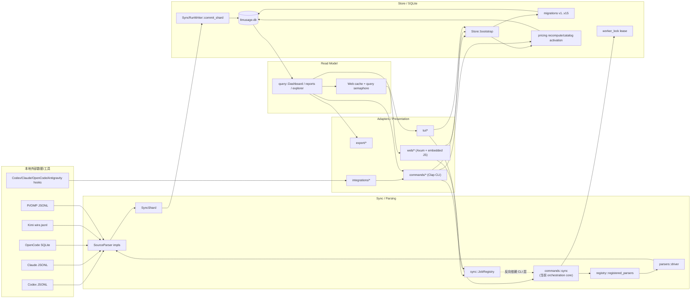
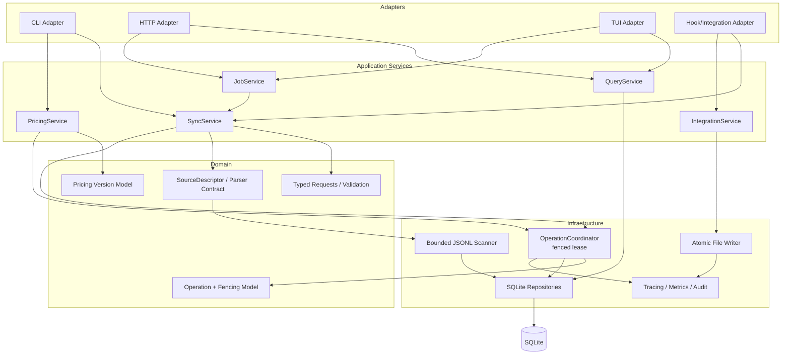
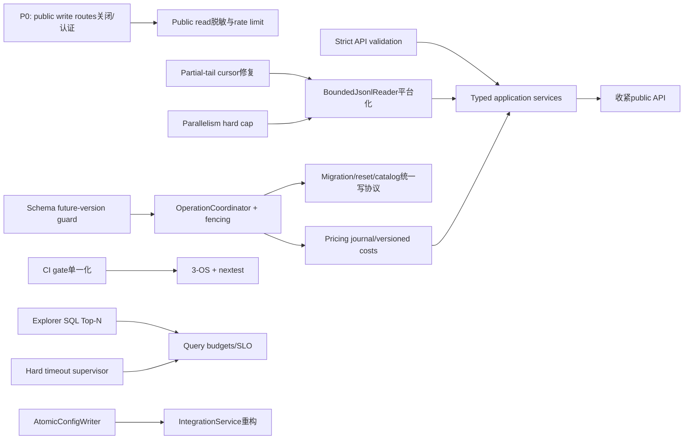

# llmuasage（crate/binary: `llmusage`）极度详细代码审计与架构评审报告

> **仓库**：`bahayonghang/llmuasage`  
> **审计快照**：`3def75ca4c177cc54b709c200d8baae3e083c04b`  
> **默认分支**：`main`  
> **crate 版本**：`1.0.2`  
> **审计日期**：2026-07-24  
> **审计方式**：基于固定 commit 的 GitHub 静态审计与跨文件调用链验证。当前执行环境无法完成仓库 clone，因此本报告没有伪造本地 `cargo test`、覆盖率、benchmark 或 `cargo audit` 结果；动态项均明确标为“⚠️ 需验证”。

---

## 审计判定口径

- **🔴 P0 致命**：存在直接未授权控制、确定性数据破坏、远程代码执行或大范围不可恢复故障路径。  
- **🟠 P1 严重**：可导致永久数据遗漏、长期数据不一致、并发双写、服务资源耗尽或核心统计错误。  
- **🟡 P2 中等**：会显著降低稳定性、可维护性、发布质量或安全纵深，但通常需要特定条件。  
- **🟢 P3 轻微**：文档、仓库卫生、低概率健壮性或风格债。  
- **客观缺陷**：可由代码路径证伪/复现。  
- **设计风险**：实现与目标边界不匹配，是否接受取决于产品约束。  
- **风格偏好**：不直接等价于 bug，单独标识，避免把主观意见伪装成缺陷。

---

# 0. 执行摘要（TL;DR）

## 0.1 仓库概况

| 项目 | 结论 |
|---|---|
| 领域 | Local-first AI coding CLI usage analytics；读取本地 Codex、Claude Code、OpenCode、Kimi Code、Pi/Oh My Pi 等数据，写入 SQLite，提供 CLI/TUI/Web/HTML export |
| 主要技术栈 | Rust 2024、Tokio、Axum、rusqlite（bundled SQLite）、Clap、Ratatui、Serde、Tracing；前端为随二进制嵌入的原生 JavaScript/CSS；文档为 VitePress |
| 入口 | `src/main.rs` → `llmusage::run()`；CLI commands、TUI、Web dashboard、offline export、独立 Codex tracer |
| 数据面 | `usage_event`、`usage_bucket_30m`、cursor/source-file state、behavior facts、pricing catalog metadata、worker lock、run log |
| Parser | 5 个：Codex、Claude、OpenCode、Kimi Code、Pi |
| Integration | 4 个：Codex、Claude、OpenCode、Antigravity |
| Schema | 15 个有序 migration |
| 规模 | 无法可靠给出全仓 LOC；已确认热点文件约为：`src/query/mod.rs` 5,047 行、`src/web/mod.rs` 4,801 行、`src/query/explorer.rs` 2,113 行、`src/store/sync_writer.rs` 1,971 行、`src/store/mod.rs` 1,138 行。仅前四个热点已超过 13,900 行 |
| 当前成熟度 | **5.8 / 10**：基础工程能力明显高于一般个人 CLI，但数据一致性、并发 fencing、public 模式安全边界和 1.0 API 收口尚未达到“稳定基础设施”水平 |

### 分维度评分

| 维度 | 评分 | 依据 |
|---|---:|---|
| 架构 | 5.6 | Registry、parser/writer boundary、migration 机制合理；但 application orchestration 泄漏到 `commands`，写协调并未闭合，多个 God module |
| 正确性/数据一致性 | 4.9 | 存在 JSONL 尾部半行永久漏记、pricing 分页部分提交、DST 历史分组错误 |
| 工程化 | 6.4 | 有 fmt/clippy/tests/docs/security audit、failpoint 与集成测试；但 CI 与 `just ci` 漂移、仅 Windows、全量单线程 |
| 性能 | 5.3 | 有 bucket、pagination、query semaphore；但 Explorer Top N 在 Rust 端截断、timeout 非硬边界、日志 tail 全文件扫描 |
| 安全 | 5.1 | 默认 loopback、无上传、SQL 参数化是优势；但 `--public` 的 Host-based write guard 可绕过，读 API 无认证且可泄露本地路径/raw JSON |
| 健壮性 | 5.2 | shard 事务较好；但 lease 丢失不触发停止、配置写入非 crash-atomic、legacy backup 非 SQLite-consistent |
| 可维护性 | 5.0 | 命名和注释总体清楚，但 1.x 仍公开大量实现模块，热点文件过大，业务层反向依赖 CLI 层 |
| 可观测性 | 6.1 | Structured NDJSON、run log、progress event 较完整；但 parser skip 无错误计数，日志仅启动时轮转 |

## 0.2 最关键风险（按影响排序）

1. **`serve --public` 的写 API 防线可以被伪造 `Host: localhost` 绕过。**  
   服务公开绑定 `0.0.0.0` 后，远程原始 HTTP 客户端可发送 loopback Host 且省略 Origin，调用 start/cancel/forget。默认 loopback 模式不受此 P0 影响，但 public 模式不能视为安全。

2. **四个 JSONL parser 会把未写完的 EOF 尾行计入 durable cursor，造成永久漏记。**  
   这是数据完整性问题，不是显示问题。追加完成后下一轮会从半行中间继续，完整事件无法恢复。

3. **worker lease 没有 fencing，也没有检测“续租 UPDATE 影响 0 行”。**  
   旧进程挂起超过 lease 后，新进程可接管；旧进程恢复后仍继续写，形成两个合法 writer。

4. **pricing recompute 与全局写锁没有形成同一原子协议。**  
   事件按 5,000 行分页提交，bucket/catalog metadata 最后才提交；bootstrap/catalog command 又可绕过 worker lock。失败或并发 sync 可产生长期 mixed pricing state。

5. **Explorer 和 Web timeout 的资源边界是“表面有界、实际无界”。**  
   `limit` 只限制最终返回，DB/Rust 仍物化全部 group/series；timeout 后仍 `await` blocking task。配合无上限 `parallelism`，public 模式可形成现实 DoS 路径。

## 0.3 总体结论

- **默认本地、单用户、loopback 使用场景**：没有发现已证实的远程 RCE、SQL injection 或默认远程暴露；基础功能架构可继续演进。
- **作为 1.0.x 稳定库/长期运行服务**：目前不应宣称强一致、强并发安全或安全公开服务。
- **发布阻断建议**：
  - public write guard 修复前，不应把 `--public` 作为可直接暴露的功能；
  - JSONL partial-tail 修复前，不应把 incremental cursor 视为无损；
  - pricing/fencing 修复前，不应允许多个写入口并发运行；
  - Explorer SQL Top-N 与 hard timeout 修复前，不应承诺大数据集稳定性。

---

# 1. 问题清单

## 1.1 全量分级表

| 维度 | 位置(file:line) | 证据 | 影响/二阶风险 | 根因 | 修复建议 | 工作量 | 信心 |
|---|---|---|---|---|---|---:|---|
| 🔴P0 安全｜客观缺陷（仅 `--public`）`SEC-001` | `src/commands/serve.rs:54-58,90-94`; `src/web/mod.rs:292-320,713-905,932-946` | public 绑定 `0.0.0.0`；mutation route 与 read route 同一 Router；guard 只检查客户端可控 `Host` 是否为 loopback，Origin 缺失时放行 | 远程客户端可伪造 `Host: localhost:<port>`，启动/取消 sync、修改 source-file state；与无上限 parallelism 组合为远程资源耗尽 | 把 HTTP authority 当成 peer identity；没有认证、route capability 或 trusted-proxy model | public 模式默认不挂载写路由；使用 `ConnectInfo<SocketAddr>` 验证 peer；引入随机 bearer token/CSRF；反代模式显式配置 trusted proxy | 1-3d | 高 |
| 🟠P1 数据完整性｜客观缺陷 `DATA-001` | `src/parsers/claude.rs:405-417`; `src/parsers/codex.rs:380-399,505-512`; `src/parsers/kimi_code.rs:329-397`; `src/parsers/pi.rs:329-407` | `read_line` 后先增加 offset，再 parse；EOF 半行 parse 失败后被跳过，返回的 `end_offset` 已越过半行 | 正在写入的 JSONL 被 sync 扫描时，事件可永久漏记；后续追加从半行中部开始 | cursor 代表“已读取字节”，而非“已确认完整 record” | durable offset 只推进到最后一个以 `\n` 结束的完整行；保留 pending tail；增加 4 parser 并发追加回归测试 | 1-2d | 高 |
| 🟠P1 并发｜客观缺陷 `CONC-001` | `src/store/lock.rs:22-62,162-267` | lease 过期可被新 owner 接管；heartbeat 失败只 warn；refresh/release 忽略 affected row count | 旧进程 sleep/hibernate/debug pause 后恢复，可与新 owner 同时写；cursor/reset/bucket 交错 | lease 没有 fencing token；“owner 已丢失”未传播到业务任务 | acquire 时递增 fencing generation；refresh 要求 `changed==1`；丢锁立即 cancel；每个 write transaction 校验 generation | 3-6d | 高 |
| 🟠P1 架构/一致性｜客观缺陷 `ARCH-001` | `src/store/schema.rs:65-108`; `src/commands/sync.rs:314-321`; `src/commands/serve.rs:50-53`; `src/commands/catalog.rs:9-71`; `src/store/sync_writer.rs:76-107` | `bootstrap()` 可执行 pricing upgrade；sync 在拿 worker lock 前先 bootstrap；serve/catalog 也直接进行 mutation；writer 启动时 snapshot catalog | repricing、migration、catalog apply/reset 与 sync 可并发；同一 DB 出现不同价格版本写入 | “全局 worker lock”只覆盖部分 command，而不是所有 mutation | 新建 `OperationCoordinator`；所有 schema/pricing/reset/sync mutation 走同一 fenced write service；read command 的 bootstrap 不得触发长业务迁移 | 4-8d | 高 |
| 🟠P1 数据一致性｜客观缺陷 `DATA-002` | `src/store/mod.rs:346-519`; `src/store/pricing_catalog.rs:201-267,398-415` | event cost 每 5,000 行独立 commit；全部完成后才在另一事务 reconcile bucket 与切 metadata；custom overlay/snapshot 没有 durable in-progress journal | 中途失败后部分 event 新价、部分旧价、bucket/meta 仍旧；状态可长期存在且难以被自动识别 | 为缩短锁时间牺牲了语义原子性，却未引入版本化或恢复日志 | 最优：versioned cost + atomic active version pointer；次优：durable operation journal、resume/rollback、启动强制恢复 | 5-10d | 高 |
| 🟠P1 性能｜客观缺陷 `PERF-001` | `src/query/explorer.rs:265-332,553-627,1402-1482` | SQL 对所有 group/series `GROUP BY` 并排序，无 SQL `LIMIT`；Rust 收集全部后才 `.take(limit)`，series 再用 BTreeMap collapse | 高 cardinality session/tool/project × 时间 bucket 导致 DB 临时表、CPU、内存随全量数据增长；GET 可耗尽 query permits | Top-N 被实现为 presentation concern，而非 query plan concern | CTE 先 aggregate，再 SQL Top-N；series 只查 top keys；Other 在 SQL 汇总；限制 date range/series point budget | 3-7d | 高 |
| 🟠P1 稳定性｜客观缺陷 `PERF-002` | `src/web/mod.rs:1030-1145` | timeout 后调用 `interrupt()`，随后仍执行 `let _ = task.await`；在 interrupt handle 尚未建立时也等待 blocking task | 配置的 timeout 不是 response latency 上限；非 SQLite 或未响应 interrupt 的工作可无限拖延，并持续占 permit | 把“清理完成”与“请求及时返回”绑定在一起 | timeout 立即返回；task 自持 permit 并后台收尾；记录 orphan duration；Rust post-processing 增加 cooperative cancellation | 2-4d | 高 |
| 🟠P1 资源治理｜客观缺陷 `RES-001` | `src/sync/job_registry.rs:131-144`; `src/commands/sync.rs:419-427`; `src/parsers/claude.rs:143-197` | API 接收任意 `usize`；runner 只 `.max(1)`；parser 以该宽度批量 `spawn_blocking` | 极大值可制造大量 blocking task、shard vector 与 I/O；public guard 绕过后可远程触发 | 仅设置下限，没有 service-side hard cap 和内存预算 | 统一校验 `1..=min(cpu*2,32)`；bounded worker pool；按估算 bytes/records 限制批次 | <1d 基础；3d 完整 | 高 |
| 🟡P2 统计正确性｜客观缺陷 `DATA-003` | `src/query/filter.rs:11-23,76-83,145-169,266-285` | `Local` 明确使用“查询时当前 fixed offset”，所有历史日期复用该 offset，测试也锁定此行为 | DST 地区的冬/夏历史数据边界偏移 1 小时，跨午夜事件进入错误日/周/月，成本按周期统计失真 | 用 fixed offset 代替 IANA timezone rule | 使用 `chrono-tz`/`jiff` 或系统 zone id；按目标日期求 offset；覆盖 spring-forward/fall-back | 2-5d | 高 |
| 🟡P2 稳定性｜客观缺陷 `REL-001` | `src/sync/job_registry.rs:189-314`; `src/web/mod.rs:292-320` | 每个成功或 rejected job 都插入 DashMap；只有 `list_recent()` 才 prune；Web 没有 list route；prune 内重复 `position` 为 O(n²) | 长期 `serve` 与 repeated rejected starts 导致 registry 无界增长；最终影响内存和操作成本 | retention 是查询副作用，且生产路径不调用该查询 | terminal transition 时维护 bounded deque/TTL；active 永不淘汰；limit/TTL 配置；O(1)/O(log n) 清理 | 1-2d | 高 |
| 🟡P2 API 契约｜客观缺陷 `API-001` | `src/sync/job_registry.rs:338-349`; `src/commands/sync.rs:400-427`; `src/web/mod.rs:1480-1527` | unknown `source` 经 `and_then(parse_id)` 变成 `None`；`None` 在 runner 代表全部 parser；unknown window 被静默忽略 | typo 本应 400，却扩大为全量 sync/全量查询；额外 I/O 与隐私/成本惊讶 | transport DTO 使用 `String`，解析失败被建模为“未提供” | serde typed enum 或 explicit validator；unknown source/window/timezone/date 返回 400 与稳定 error code | 0.5-1d | 高 |
| 🟡P2 规则/契约｜客观缺陷 `CONTRACT-001` | `src/sync/job_registry.rs:131-143`; `src/parsers/driver.rs:46-55,129-134`; `docs/reference/cli.md:约 80-110` | `recent_days` 注释说明 M0 只存 option；driver 仅在完整 parse 后 mark `RecentReady`，未限制扫描范围 | 用户以为是 bounded import，实际可能执行完整 cursor/文件扫描；SLO 与命令语义不可信 | readiness signal 与 import filter 共用同一参数名 | 真正实现时间/offset pruning，或改名为 `recent_ready_window` 并在 response 返回 `applied=false` | 1-5d | 高 |
| 🟡P2 架构｜客观缺陷 `ARCH-002` | `src/sync/job_registry.rs:15-20,329-382` | `sync::JobRegistry` 直接 import/call `commands::sync::{SyncRunOptions, SyncSummary}` | application/domain 层反向依赖 CLI adapter；Web job orchestration 被 CLI command API 绑死 | 缺失独立 application service | 提取 `application::SyncService` 与 `SyncRequest/SyncResult`；CLI/Web/TUI 仅做 adapter | 3-6d | 高 |
| 🟡P2 可维护性｜客观缺陷 `MAINT-001` | `src/query/mod.rs:1-5047`; `src/web/mod.rs:1-4801`; `src/query/explorer.rs:1-2113`; `src/store/sync_writer.rs:1-1971` | 单文件混合 router、security、cache、DTO、query execution、lifecycle、tests；四个文件均 >1,900 行 | review 半径大、冲突率高、局部修改难以证明无回归；复杂度热点集中 | 按“历史增长”而非稳定边界拆分 | 按 vertical slice 拆为 route/guard/state/query/cache；store 拆 transaction protocol/repository；设置文件与函数预算 | 1-3w | 高 |
| 🟡P2 公共 API｜设计债 `API-002` | `Cargo.toml:3-17`; `src/lib.rs:3-39` | crate 已 1.0.2，但公开 `commands/common/domain/parsers/registry/runtime/tui/web` 等实现模块；注释称为 0.7.x compatibility 且“可能变化” | 1.x 下这些 public item 默认形成 semver 承诺，阻碍内部重构 | 兼容层没有 feature/unstable namespace 与淘汰计划 | 两个 release 周期 deprecate；实现改 `pub(crate)`；保留稳定 façade；CI 加 `cargo-semver-checks` | 1-2w | 高 |
| 🟡P2 CI｜客观缺陷 `CI-001` | `justfile:60-69`; `.github/workflows/ci.yml:82-92` | 本地 `just ci` 跑 4 个 dashboard JS tests；GitHub Actions 只跑 `dashboard-fetch` | watchdog/load-state/render-lifecycle regression 可合并进 main | 两份手工 gate 清单漂移 | Actions 直接调用 `just ci`，或所有环境调用单一 `scripts/ci.*` | <0.5d | 高 |
| 🟡P2 CI｜客观缺陷 `CI-002` | `.github/workflows/ci.yml:16-20,67-80` | Rust 主 job 仅 `windows-latest`；所有 Rust tests 强制 `--test-threads=1` | Linux/macOS path/hook/permission 失败不被 gate；真实并发交错完全没有覆盖 | 以消除 flaky 为目标牺牲平台和并发信号 | Windows/Ubuntu/macOS fast matrix；MSRV 1.85；正常 parallel suite + nextest 串行 group | 1-2d | 高 |
| 🟡P2 供应链｜设计风险 `SUPPLY-001` | `.github/workflows/ci.yml:22-31,67-80,99-111`; `Cargo.toml:3-13` | Rust toolchain 用 moving `stable`；third-party Actions 用 mutable tags；cargo commands 未统一 `--locked`；未见 dependency update bot 配置 | 构建可重复性与 workflow supply-chain 纵深不足；同一 commit 随时间行为可能变化 | 版本策略没有固化到 repo | `rust-toolchain.toml` 固定 1.85 + stable matrix；Actions pin SHA；cargo `--locked`；Dependabot/Renovate、cargo-deny、SBOM | 1-2d | 中高 |
| 🟡P2 供应链｜设计风险 `SUPPLY-002` | `src/commands/update.rs:157-173`; `README.md:28-40` | self-update 执行 `cargo install --git ... --branch main/dev --locked --force` | branch 被 force-push/账号被攻破时，用户执行任意新 HEAD；`--locked` 不固定源码 commit | 更新信任锚是可变 branch | 发布签名/校验和二进制；或 immutable tag+SHA；UI 展示将安装 commit；dev 明确 unsafe | 2-5d | 中高 |
| 🟡P2 安全｜客观缺陷（条件触发）`SEC-002` | `src/integrations/hook_target.rs:53-110`; `src/integrations/opencode.rs:304-319` | POSIX 路径用双引号，仅 escape `"`，未防 `$()`, backtick, backslash；OpenCode 再把整条 command 插入 JS template literal | 当前 exe/home 位于恶意特殊字符路径时，可改变 shell/JS 语义，潜在本地代码执行 | 多层 context 复用同一 string escaping | 尽量用 argv；POSIX 单引号 escaper；Windows 使用成熟 quoting；JS 通过 JSON string literal/参数数组；property tests | 1-2d | 中高 |
| 🟡P2 健壮性｜客观缺陷 `REL-002` | `src/integrations/mod.rs:47-71,144-159`; `src/commands/init.rs:24-39` | 每个 install error 被转成 `IntegrationAction{status:error}` 后整体仍 `Ok(Vec)`；`init` 打印后返回 0 | 自动化认为 init 成功，但 hooks/plugin 可能未安装；后续 sync 数据缺失难定位 | partial success 没有映射到 process exit contract | required integration 任一失败返回 typed `PartialFailure` 与非零 exit；提供显式 `--best-effort` | <1d | 高 |
| 🟡P2 文件一致性｜客观缺陷 `REL-003` | `src/integrations/claude.rs:82-108,127-153`; `src/integrations/opencode.rs:68-99`; `src/integrations/mod.rs:81-104` | 先 backup 后直接 `fs::write` 目标 config/plugin/wrapper；没有 temp+fsync+rename、permission preservation 或失败回滚 | crash、disk-full、antivirus/同步软件干扰可留下截断配置；record_action 失败时外部配置已改变 | 文件 mutation 不具备 transaction protocol | sibling temp、flush/fsync、preserve mode、atomic rename；记录失败时回滚；Windows replace compatibility tests | 2-4d | 高 |
| 🟡P2 备份｜客观缺陷 `REL-004` | `src/integrations/mod.rs:107-112` | backup 文件名只使用 `now_utc()` 文本且 `fs::copy` 默认覆盖已存在目标 | 同 stem 同秒执行可覆盖真正的“原始备份”，降低 uninstall/recovery 可靠性 | backup identity 不是唯一且未 `create_new` | 加 nanosecond/UUID/content hash；`create_new(true)`；manifest 记录 source、digest、time | <0.5d | 高 |
| 🟡P2 可观测性/性能｜客观缺陷 `OBS-001` | `src/runtime/logging.rs:65-91,142-180` | 10 MiB 检查只在进程启动时执行，随后使用 `rolling::never`；读取最近日志从文件头遍历到 EOF | 长期 serve 日志可无限增长；`logs/diagnostics` tail 延迟 O(file size) | rotation 与 tailing 都不是持续有界设计 | size/daily rotation + retention；反向 tail 或 index；对 dropped non-blocking logs 暴露 metric | 1-3d | 高 |
| 🟡P2 信息泄露｜客观缺陷 `SEC-003` | `src/web/mod.rs:762-774,1565-1582` | 500 JSON 把 `err.to_string()` 放入 `detail` 返回客户端 | public 模式可泄露 SQLite、文件路径、内部状态；为后续攻击提供环境信息 | internal error chain 与 public response 未分层 | 返回 generic code/message/request_id；完整 chain 只写 structured log | <0.5d | 高 |
| 🟡P2 隐私边界｜设计风险 `SEC-004` | `README.md:61`; `src/web/mod.rs:292-320`; `src/query/logs.rs:44-107,159-199` | `--public` 明确无认证/TLS；read API 暴露 project path，且可选 raw JSON | 局域网/公网误暴露时，使用量、项目路径、session、原始记录可被读取 | public mode 把 local diagnostics API 整体暴露 | public 只暴露 allowlist/脱敏 snapshot；auth；默认拒绝 raw JSON/path；独立 `--unsafe-public-raw` | 1-3d | 高 |
| 🟡P2 Schema 兼容性｜客观缺陷 `DATA-004` | `src/store/migrations.rs:85-105,129-178`; `src/store/schema.rs:88-108` | malformed schema version 被当 0；`current > latest` 没有 fail-fast；旧 binary 可继续 bootstrap/open | downgrade 或 metadata corruption 时，旧代码可能在新 schema/contract 上写入，造成静默破坏 | migration runner 只考虑向前升级 | malformed version 是 hard error；增加 `SchemaTooNew{db,binary}`；可选 read-only compatibility | 0.5-1d | 高 |
| 🟡P2 备份一致性｜客观缺陷 `DATA-005` | `src/store/connection.rs:38-47`; `src/store/schema.rs:243-249` | connection 开启 WAL；pre-0.5 backup 仅 `fs::copy` 主 DB 文件，不使用 SQLite backup API，也不包含 WAL | 有未 checkpoint page 或并发写时，所谓 recovery backup 可能陈旧/不一致 | 把 SQLite 当普通文件复制 | 在 write coordinator 下使用 SQLite online backup/VACUUM INTO；checkpoint；备份后 `integrity_check` | 1-2d | 高 |
| 🟡P2 数据质量/资源｜客观缺陷 `DATA-006` | `src/parsers/claude.rs:405-417`; `src/parsers/kimi_code.rs:329-397`; `src/parsers/pi.rs:329-407`; `src/parsers/codex.rs:380-399` | 完整但 malformed JSON line 被静默 `continue`；没有 parse-error count/path/offset；`read_line` 对单行长度无上限 | 数据损坏被误报为成功；超大行可分配巨量内存并导致 OOM | parser 将“忽略”与“错误”混为同一控制流 | `ParseIssue` 计数与 sampled diagnostics；strict mode；最大 record size（如 4 MiB，可配置） | 2-4d | 高 |
| 🟡P2 取消语义｜客观缺陷 `REL-005` | `src/parsers/claude.rs:182-230`; 其他 file parser 同型 | cancel 只在 batch/task await 边界检查；已 `spawn_blocking` 的 parser 不读取 token；break 后任务仍运行 | API 显示 cancelling/cancelled 后，CPU/磁盘 I/O 仍持续；新任务可能与旧扫描重叠 | blocking scan 无 cooperative cancellation contract | 每 N 行/字节检查 token；bounded pool；状态保持 `cancelling` 直到所有 worker drain | 2-5d | 高 |
| 🟡P2 法务/发布｜客观缺陷 `LEGAL-001` | `Cargo.toml:3-13`; `LICENSE-APACHE`（快照中缺失） | package metadata 声明 `MIT OR Apache-2.0`，仓库仅能确认 MIT license 文件 | crates/reuse scanner 可能判定 license 不完整；用户无法按 Apache-2.0 条款可靠取证 | metadata 与分发文件不一致 | 添加标准 Apache-2.0 文本及 NOTICE（如需），或把 metadata 改为实际单许可证 | <0.5d | 高 |
| 🟢P3 文档｜客观缺陷 `DOC-001` | `Cargo.toml:3-13`; `src/lib.rs:5-11`; `docs/architecture/index.md:3-5,70-75`; `.github/workflows/ci.yml:40-65` | package 1.0.2；lib 注释仍称 0.7.x compatibility；架构文档称 0.6.x；CI version check 只检查有限文件 | API/架构认知漂移，reviewer 与下游调用方无法判断当前承诺 | 版本文本散落且 gate 不完整 | 文档使用“current”而非硬编码；生成版本页；CI 搜索旧版本 pattern | <0.5d | 高 |
| 🟢P3 仓库卫生｜客观问题 `HYGIENE-001` | `Cargo.toml:4,9-10`; `README.md:3-9`; `.gitignore:35`; `output/playwright/sync-command-center-verify.json:1+` | package/binary 是 `llmusage`，repo 为 `llmuasage`；`output/` 已 ignore 但快照仍跟踪 Playwright 产物 | 搜索、链接、品牌与自动化路径易拼错；生成物制造 diff 噪音 | 历史命名错误和已跟踪文件不会因 ignore 自动删除 | 能迁仓则 rename；否则明确 canonical naming；`git rm --cached output/`，CI artifact 上传替代 commit | 0.5-1d | 高 |
| 🟢P3 健壮性｜潜在客观缺陷 `REL-006` | `src/store/schema.rs:223-241` | public `reset_usage_data()` 以多条 DELETE `execute_batch` 执行，未显式事务；当前未发现 production caller | 未来调用或中途错误时可能留下部分 reset；对 public Store API 是不安全默认 | 低层 destructive API 未自带 atomicity | 包裹 immediate transaction，或降为 `pub(crate)` 并只暴露安全 orchestration | <0.5d | 中高 |

---

## 1.2 P0/P1 关键问题深挖

### SEC-001：`--public` write guard 的信任边界错误

#### 可复现攻击路径

1. 用户运行 `llmusage serve --public`，代码绑定 `0.0.0.0`。
2. Router 同时挂载：
   - `POST /api/jobs`
   - `POST /api/jobs/{id}/cancel`
   - `POST /api/diagnostics/forget`
3. guard 从 HTTP `Host` header 解析 authority，只要 host 是 `localhost` 或 loopback 即通过。
4. `Origin` 仅在存在时校验；非浏览器客户端可以不发送。
5. 远程客户端连接真实服务器 IP，但发送：
   ```http
   POST /api/jobs HTTP/1.1
   Host: localhost:9876
   Content-Type: application/json

   {"parallelism":18446744073709551615}
   ```
6. 应用无法从 `Host` 判断对端是否 loopback，因此 guard 通过。

#### 最强反驳

- 默认模式只绑定 `127.0.0.1`，该模式下远程网络无法连接。
- 普通浏览器跨域 JSON POST 通常触发 CORS preflight，当前服务不会主动允许。
- CLI 已打印“无认证、无 TLS”的警告。

#### 结论

这些反驳只能说明**默认模式较安全**，不能证明 public 模式的 write guard 有效。Guard 的文案和代码意图是“本地写入 API”，但它使用了客户端声明而非网络 peer identity。该问题在 `--public` 下是确定性绕过，因此列为条件性 P0。

#### 推荐目标实现

```rust
enum WriteExposure {
    Disabled,                     // public 默认
    LoopbackPeerOnly,             // 仅真实 peer IP loopback
    BearerToken(SecretString),    // public 显式开启
}

async fn mutation(
    ConnectInfo(peer): ConnectInfo<SocketAddr>,
    State(policy): State<WriteExposure>,
    headers: HeaderMap,
) -> Response {
    policy.authorize(peer.ip(), &headers)?;
    // ...
}
```

- `--public` 默认只挂载 read-only、脱敏 route。
- `--public-write` 必须同时提供随机 token，token 文件权限为 0600。
- behind-proxy 模式只有在显式列出 trusted proxy CIDR 后才读取 `Forwarded`/`X-Forwarded-For`。
- 写路由增加 CSRF token；不要把 CORS 当认证。

#### 验收标准

- 远程 peer + `Host: localhost` 必须 403。
- loopback peer + 正确 token 成功。
- public 无 token 时 Router 根本不存在 mutation route，返回 404/405。
- reverse proxy 未配置 trusted proxy 时，伪造 forwarding header 无效。
- security regression test 使用真实 TCP socket，而不是仅构造 HeaderMap。

---

### DATA-001：JSONL 尾部半行永久漏记

#### 时间线

- **T0**：producer 正在追加一行，例如只写入 `{"usage": ...`，尚未写完或尚未写换行。
- **T1**：sync 调用 `read_line`。Rust 在 EOF 可返回这段非空字符串，即使没有 `\n`。
- **T2**：代码先 `offset += bytes_read`，随后 JSON parse 失败并 `continue`。
- **T3**：cursor commit 到当时 EOF。
- **T4**：producer 继续写完 `...}\n`。
- **T5**：下一次 sync 从 T1 的 EOF 开始，即从逻辑 JSON 中间读取余下内容；仍 parse 失败。
- **结果**：该事件永久消失，除非手动 rebuild/reset cursor。

#### 最强反驳

“上游通常一次性写完整行，并立即换行。”这在正常运行中可能大部分成立，但文件 append 与 reader 并发没有跨进程原子 JSON record 保证；长行、缓冲 flush、进程 crash 均可暴露半行。Local-first analytics 的核心承诺是 incremental/idempotent，不能把完整性建立在未声明的 producer 时序上。

#### 修复协议

- `durable_offset` 与 `read_offset` 分离。
- 每次记录 `line_start`.
- 当 `!line.ends_with('\n')` 且到达 EOF：
  - 不把该行交给 durable parser，或允许 parse 但不推进 durable cursor；
  - `end_offset = line_start`；
  - 下一次从完整行起点重读。
- 若上游可能最后一行永久不带换行，可增加“文件在 N 秒内未变化后接受 EOF 完整 JSON”的稳定期策略；默认 append-only producer 应优先无损。
- 所有 parser 共享一个 `BoundedJsonlReader`，避免四份逻辑继续漂移。

#### 必须增加的测试

1. 写半行 → sync → 追加余下半行 → sync，最终恰好 1 event。
2. 半行跨 UTF-8 multi-byte boundary。
3. 半行在 4 MiB limit 附近。
4. sync 期间 producer 连续追加多行。
5. cursor commit failpoint 后重试，仍无重复/遗漏。
6. Codex、Claude、Kimi、Pi 全部复用同一 contract test。

---

### CONC-001：lease 不是锁；缺少 fencing 后会双写

#### 失败场景

1. 进程 A 获得 lease，generation 不存在。
2. A 因 laptop sleep、VM suspend、debug breakpoint 或长 stop-the-world 超过 30 分钟。
3. 进程 B 看到 lease expired，更新 row 成自己的 `owner_id`，开始 sync。
4. A 恢复；其 heartbeat 执行 `UPDATE ... WHERE owner_id=A`，影响 0 行。
5. 当前代码忽略 affected row count并返回 `Ok(())`，A 不知道锁已丢失。
6. A 与 B 同时执行 shard transaction。

SQLite 可以串行化每个具体 transaction，但不能保证 A、B 的**业务操作顺序**。例如 A reset 旧 path event，B 写新 event，A 再写旧 cursor，最终状态不等价于任何单一合法 sync。

#### 最强反驳

lease 较长，heartbeat 每约 10 分钟执行；普通桌面用户很少两个进程同时 sync。  
该反驳只能降低概率。Laptop sleep 与长时间挂起是桌面应用常见状态，且一旦发生影响是数据一致性而非短暂错误。

#### 正确修复：fenced lease

DB row 增加 `generation INTEGER NOT NULL`：

- acquire/steal 在 `BEGIN IMMEDIATE` 中将 generation + 1。
- `WorkerLock` 持有 `(owner_id, generation)`。
- heartbeat `WHERE owner_id=? AND generation=?`，要求 affected rows = 1。
- 每次 `commit_shard`、pricing activation、reset、migration 等 mutation 在事务开始时校验当前 generation。
- 一旦 heartbeat 0 rows：
  - 设置 cancellation token；
  - 新 write transaction 返回 `LockLost`；
  - Job 状态变为 failed/cancelled，不能继续 commit。

---

### ARCH-001 + DATA-002：写协调不闭合与 pricing mixed-state

这两个问题必须一起修。单独给 pricing 加一把局部 mutex 不能解决多进程，也不能覆盖 bootstrap。

#### 当前状态机

| 阶段 | 当前提交行为 | 崩溃后状态 |
|---|---|---|
| Persist catalog files | 先写 content-addressed 文件 | 文件存在但未 active，一般可接受 |
| Reprice event page 1..N | 每 5,000 行事务提交 | 已提交 page 不回滚 |
| Build bucket rollup | Rust HashMap 持有全量 bucket rollup | 进程退出即丢失 |
| Reconcile bucket + metadata | 最终独立事务 | 若未执行，event 与 bucket/meta 不一致 |
| Sync writer | 启动时 snapshot 当前 catalog | 与并发 repricing 可使用不同版本 |

#### 最强反驳

分页事务避免一次长事务锁住 SQLite；失败后用户可以重新执行 catalog command。  
问题在于系统没有 durable operation state，无法自动证明“必须重跑”，custom snapshot/overlay 也未必在下一次 bootstrap 自动恢复。对用户而言，报表仍能读，但数值已经混合。

#### 推荐方案 A：版本化成本（优先）

- `usage_event_cost(event_key, pricing_version, ...)`
- `usage_bucket_cost(bucket_key, pricing_version, ...)`
- 后台生成新 version，不改 active read。
- 全部完成并校验 row count/bucket totals 后，在一个小事务中切 `active_pricing_version`。
- 旧 version 延迟 GC。
- Sync writer 将新事件同时按 active version 写入；若 rebuild 新 version，可通过 backfill 补齐。

这使 reprice 从“原地修改”变成“构建新快照 + atomic pointer switch”。

#### 推荐方案 B：durable journal（短期）

`pricing_operation`：

```text
operation_id
from_version
to_version
phase = events | buckets | activate | done
last_event_key
updated_events
started_at
error
```

每页 commit 同时更新 `last_event_key`。bootstrap 发现非 done operation 时必须 resume 或显式 rollback，禁止正常读写假装一致。

#### 验收标准

- 在第 1、2、最后一页之后注入 crash，重启能自动恢复到单一 version。
- 在 bucket reconcile 前 crash，读 API 不得返回 mixed data。
- sync 与 catalog apply 并发，只有一个 fenced writer 能 commit。
- `SUM(event cost)` 与对应 bucket cost 在 tolerance 内一致。
- metadata version、event version、bucket version 三方 invariant 可由 `doctor` 检查。

---

### PERF-001：Explorer 的 Top N 没有进入 SQL query plan

#### 当前复杂度

设 group 数为 `G`，时间 bucket 数为 `B`，请求 limit 为 `L`：

- 当前 rows：数据库产生并排序 `G` 行，Rust 收集 `G`，最终返回 `L`。
- 当前 series：数据库产生最多 `G × B` 行，Rust 收集全部，再 collapse 成 `(L + Other) × B`。
- `Other` 的存在进一步要求读取全部 tail，但不代表必须把每个 tail group × bucket 都传回 Rust。

#### 目标 query plan

```sql
WITH agg AS (
  SELECT group_key, group_label, SUM(metric) AS value
  FROM ...
  WHERE ...
  GROUP BY group_key, group_label
),
top_groups AS (
  SELECT group_key, group_label, value
  FROM agg
  ORDER BY value DESC, group_label
  LIMIT ?
)
SELECT * FROM top_groups;
```

Series：

- 先确定 top key set。
- top key 的 series 正常 aggregate。
- 非 top key 全部在 SQL 中按 bucket 汇成一条 `Other`。
- 增加硬预算：
  - 最大查询天数；
  - 最大时间 bucket；
  - 最大 materialized points；
  - 最大 response bytes。

#### 验收标准

- 100 万 event、10 万 session、365 天 daily query，p95 < 2s（目标需按实际硬件校准）。
- `EXPLAIN QUERY PLAN` 不出现无必要全表 temp sort；关键 index 命中。
- Rust peak RSS 不随全量 G 线性增长，只随 `L × B` 增长。
- 请求超预算返回明确 422/413，而不是超时 500。

---

### PERF-002：timeout 必须限制响应，而不是等待清理完成

当前代码在 timeout 后 interrupt SQLite，然后等待 blocking task。更安全的模型：

- blocking task 自己持有 query permit。
- request future timeout 后：
  - 发 cancellation/interrupt；
  - 立即返回 504；
  - 将 task 交给 supervisor 观察；
  - supervisor 记录实际停止时间与 stuck count。
- Rust 端大循环每 N 行检查 cancellation。
- `Dashboard::open`、filesystem、JSON serialization 等阶段也纳入 budget 或单独 timeout。

验收：

- 注入一个忽略 SQLite interrupt、sleep 60s 的 blocking closure，请求在配置 timeout ±100ms 返回。
- permit 直到任务真正结束才释放，避免 timeout 后无限创建 orphan。
- 暴露 `dashboard_query_inflight`, `timed_out_tasks`, `orphan_duration_ms`。

---

### RES-001：parallelism 必须是 service-side 约束

不能依赖调用方“合理传值”。建议：

```rust
const MAX_SYNC_PARALLELISM: usize = 32;

fn normalize_parallelism(requested: Option<usize>) -> Result<usize> {
    let cpu_default = available_parallelism().map(|n| n.get().min(4)).unwrap_or(1);
    let value = requested.unwrap_or(cpu_default);
    if !(1..=MAX_SYNC_PARALLELISM).contains(&value) {
        return Err(InvalidArgument::parallelism(value, 1, MAX_SYNC_PARALLELISM));
    }
    Ok(value)
}
```

进一步增加：

- 单 shard 最大 events/bytes；
- blocking worker pool，不直接按请求宽度调用全局 Tokio blocking pool；
- Web API rate limit；
- public mutation 必须认证。

---

## 1.3 已排除或未证实的高风险误报

下列项目在本次静态证据中**没有被证实**，不应为了“问题数量”而强行列为漏洞：

1. **SQL injection**：抽查的 `QueryFilter` 将用户值作为 rusqlite parameters，动态拼接主要是受控 column/expression/table 常量；未发现把任意请求字符串直接拼入 SQL 的确定路径。
2. **普遍性 XSS**：前端存在集中 `escapeHtml()`，抽查 render 模块也在使用；未完成全量 DOM sink taint analysis，因此结论是“未证实”，不是“绝对不存在”。
3. **默认远程暴露**：`serve` 默认绑定 `127.0.0.1`，P0 只针对显式 `--public`。
4. **Heatmap/Logs 参数完全无界**：Heatmap 天数有 366 上限，Logs page size 有 500 上限；这两项不列为缺陷。
5. **每个 shard 非原子**：`SyncRunWriter::commit_shard` 已把 reset/event/cursor/source-file/raw/behavior 写入收敛到事务，并有 failpoint 测试设计；真正问题是更高层的 lease/fencing 与 pricing 全局协议。
6. **migration 单步非原子**：每个 migration 在 `TransactionBehavior::Immediate` 中执行并更新 schema version；问题是 downgrade guard 与 migration 外的 pricing mutation。
7. **硬编码 secret**：未发现仓库内直接硬编码 token/password/private key 的证据。
8. **N+1 普遍存在**：部分路径存在循环查询，但没有足够证据将其上升为全局 N+1 缺陷；应以 query profiling 再判断。

---

# 2. 架构评估

## 2.1 当前真实架构图



### 图中最重要的红旗

- `sync::JobRegistry -> commands::sync`：下层业务组件反向依赖 CLI adapter。
- `Store::bootstrap -> pricing recompute`：看似基础设施初始化，实际包含长时间业务数据 mutation。
- `worker_lock` 只包住部分 `commands::sync`，而 bootstrap/catalog/migration/forget 等写路径不统一进入同一 coordinator。
- Web Router 同时包含 read、write、security guard、cache、query execution、server lifecycle，边界过宽。
- Query limit/cancellation 在 Rust presentation 层收口，未进入 SQL execution plan。

## 2.2 当前架构中值得保留的部分

这些不是客套话，而是重构时不应破坏的资产：

1. **集中 Source Registry**  
   `registered_parsers()`、`registered_integrations()` 与 descriptor consistency tests 降低新增 source 时的 fan-out 漂移。

2. **Parser/Writer 边界**  
   Parser 产出 `SyncShard`，不直接写 SQLite；`commit_shard` 负责事务协议。这是正确方向。

3. **每 migration 独立事务**  
   schema version 与 migration 同事务更新，单步失败不会假装完成。

4. **Local-first 与默认 loopback**  
   无远程 usage API、默认 `127.0.0.1`，显著降低默认攻击面。

5. **参数化 SQL filter**  
   用户值基本通过 rusqlite parameter 绑定，动态 SQL 主要来自受控枚举表达式。

6. **Source-file rebuild safety**  
   对 missing source files 的 lossy rebuild guard 是合理且重要的产品安全设计。

7. **Structured logging、run log、progress event**  
   已具备演进为可观测 operation model 的基础。

## 2.3 主要架构反模式 vs 目标架构

| 当前反模式 | 具体表现 | 目标 |
|---|---|---|
| Hidden write in bootstrap | 所有 read command 可能在 bootstrap 中触发 repricing | `SchemaBootstrap` 只做短 schema 检查；长 mutation 成为显式 maintenance operation |
| Application logic in CLI | `JobRegistry` 调用 `commands::sync` | 独立 `application::SyncService`，CLI/Web/TUI 都是 adapter |
| Incomplete global write boundary | sync 有 worker lock，pricing/catalog/bootstrap 等绕过 | 所有 mutation 必须经过 fenced `OperationCoordinator` |
| Lease without fencing | 旧 owner 恢复后仍能写 | generation/fencing token 被每个 transaction 校验 |
| In-place derived-data rewrite | pricing 原地改 event，再改 bucket/meta | versioned derived data + atomic active pointer |
| Post-query limiting | Explorer 全量 group/series 后 Rust Top N | SQL Top-N、Other aggregation、point budget |
| Transport strings in core | `source: Option<String>`，invalid 退化为 None | typed request DTO + validation boundary |
| In-memory lifecycle as query side effect | Job retention 依赖 `list_recent()` | bounded lifecycle store，在 terminal transition 清理 |
| Broad public implementation API | 1.x 公开 commands/parser/web internals | 稳定 façade + `pub(crate)` internals + feature-gated unstable API |
| God modules | web/query/store 文件数千行 | vertical modules，每个模块拥有清晰 DTO/service/repository boundary |

## 2.4 建议目标架构



### 强制依赖规则

1. `adapters -> application -> domain`.
2. Infrastructure 实现 domain/application port，但 domain 不 import infrastructure。
3. `commands`, `web`, `tui` 之间禁止互相 import。
4. 所有 DB mutation API 必须要求 `WritePermit/FencingToken`，类型系统阻止绕过。
5. Read path 不允许隐式启动长 mutation。
6. Transport DTO 不直接进入 domain；先完成 typed validation。
7. Derived data 必须可重建、可版本化、可校验。

---

# 3. 优化 Plan

## 3.1 阶段一：Quick Wins（低成本高收益，每项 <1d，建议立即进入 release blocker）

| 动作 | 优先级/依赖 | 量化预期收益 | 风险 | 回滚策略 | 验收标准 |
|---|---|---|---|---|---|
| public 模式不挂载 mutation routes，临时移除 Host guard 的“安全承诺” | P0；无依赖 | 未授权远程写路径 3 → 0 | 依赖 public remote sync 的少量用户受影响 | feature flag 暂时恢复，但必须显式 `--unsafe-public-write` | 远程 `Host: localhost` 仍无法命中 POST route |
| Clamp/validate sync parallelism | P1；无依赖 | 理论 task fan-out 从无界 → ≤32 | 极端高核机器吞吐可能下降 | env/hidden debug override，不允许 Web 使用 | 0、33、`usize::MAX` 均返回 400/CLI error |
| JSONL EOF 半行不推进 cursor | P1；parser shared helper 可后续做 | 消除一条确定性永久漏记路径 | 永久无换行的最后一行会延迟到稳定期 | feature toggle `accept_stable_eof_record` | 四 parser partial-tail contract test 通过 |
| CI 调用单一 gate，补齐 4 个 JS tests | P2；无依赖 | GitHub JS gate 1/4 → 4/4 | CI 时间略增 | 单个 flaky test 可临时 quarantine，但不得删除 | `just ci` 与 Actions 命令来源只有一处 |
| 添加 Apache-2.0 license 或修正 metadata | P2；无依赖 | license scanner mismatch 1 → 0 | 许可证选择需 owner 决策 | 改为 MIT-only | `cargo package --list` 与 REUSE/license scan 通过 |
| Web 500 response 去除 `detail` | P2；无依赖 | 客户端 internal detail 暴露 → 0 | 调试体验下降 | request_id 可查本地日志 | response 仅 code/message/request_id |
| Schema version `> latest` 和 malformed fail-fast | P2；无依赖 | downgrade/corruption 静默写入 → 明确拒绝 | 老库异常 metadata 需要手工修复 | readonly diagnostic command | 单测覆盖 malformed、future version |
| JobRegistry 在 terminal 时保留上限 | P2；无依赖 | terminal job 内存无界 → ≤100/TTL | 旧 job URL 可能更早 404 | 上限调大 | 10k rejected starts 后 map 仍有界 |

## 3.2 阶段二：中期重构（1-3 周，按依赖执行）

### 3.2.1 建立统一写协调与 fencing

| 项目 | 内容 |
|---|---|
| 动作 | 新建 `OperationCoordinator`；worker row 增加 generation；`SyncRunWriter`, PricingService, migration/reset 都要求 `WritePermit` |
| 前置依赖 | Schema migration；明确 hook/manual/catalog/serve repair 的 operation priority |
| 预期收益 | 双 writer 可提交窗口 → 0；所有 mutation coverage 100% |
| 回归风险 | hook 高频触发可能更常收到 busy/skip；migration 与 sync lock order 需统一 |
| 回滚 | 保留旧 lock schema 一版兼容读取；feature flag 切回 owner-only，但仅用于紧急恢复 |
| 验收 | suspend/resume + competing process chaos test；旧 generation 每个 write transaction 都失败 |

### 3.2.2 Pricing durable operation

| 项目 | 内容 |
|---|---|
| 动作 | 先实现 journal/resume，再演进 versioned cost table |
| 前置依赖 | OperationCoordinator |
| 预期收益 | 任意 failpoint 后 mixed-state 持续时间从“无限”降为“重启自动恢复”；event/bucket/meta invariant 可验证 |
| 回归风险 | DB size 增长、migration 时间、兼容旧 catalog |
| 回滚 | 保留旧 active version，pointer 未切换前直接删除 staging version |
| 验收 | 每页、bucket reconcile、metadata switch 前后 crash test；`doctor` invariant 全绿 |

### 3.2.3 Strict API validation

| 项目 | 内容 |
|---|---|
| 动作 | `SyncRequest`、`ExplorerRequest`、`Window`、`SourceKind` typed deserialize；统一 400 error schema |
| 前置依赖 | 无，可并行 |
| 预期收益 | invalid source 扩大为全量操作的路径 1 → 0；静默忽略参数 0 |
| 风险 | 旧客户端依赖宽松输入 |
| 回滚 | 一版 compatibility warning + response deprecation |
| 验收 | property tests/fuzz；所有 unknown enum 都是 400，不退化为 None |

### 3.2.4 Hard timeout 与 bounded background work

| 项目 | 内容 |
|---|---|
| 动作 | timeout 立即响应；task supervisor；permit 由 task 持有；cooperative cancellation |
| 前置依赖 | query metrics |
| 预期收益 | request p99 上限与配置一致；stuck task 可观测 |
| 风险 | timeout 后后台任务短时占资源 |
| 回滚 | 调大 timeout，不回到等待 task 的语义 |
| 验收 | 故意 sleep 60s 的 task，HTTP 按 2s timeout 返回；inflight 不超过 permit |

### 3.2.5 Atomic integration file mutation

| 项目 | 内容 |
|---|---|
| 动作 | `AtomicConfigWriter`：temp、fsync、mode、rename、backup manifest、rollback |
| 前置依赖 | Windows replace strategy |
| 预期收益 | crash-induced truncated config 路径 → 0 |
| 风险 | Windows 文件占用导致 rename 失败 |
| 回滚 | 原文件保留，temp 清理 |
| 验收 | disk-full/failpoint/permission tests；失败后原文件 digest 不变 |

### 3.2.6 CI 平台与并发恢复

| 项目 | 内容 |
|---|---|
| 动作 | Ubuntu/Windows/macOS matrix；MSRV 1.85；nextest groups；正常并行测试 |
| 前置依赖 | 标注真正需要串行的 tests |
| 预期收益 | functional OS coverage 1 → 3；并发交错覆盖从近似 0 → 专项 suite |
| 风险 | 暴露环境耦合/flaky |
| 回滚 | 仅隔离具体 test，不允许全套 `test-threads=1` |
| 验收 | PR fast lane 三 OS；nightly stress 重复 100 次 lock/sync tests |

## 3.3 阶段三：长期架构演进（3-8 周）

### 3.3.1 Explorer Query Engine 重构

- 将 `ExplorerQueryPlan` 与 SQL generation 独立。
- 先做 `TopKeysPlan`，再做 `SeriesPlan`.
- Other 由 SQL aggregate。
- 为每个 dimension/metric 声明：
  - required table；
  - cardinality class；
  - index requirements；
  - max range；
  - degrade behavior。
- 建立 10k/100k/1m/10m event synthetic benchmark。
- SLO：常规 dashboard p95 < 500ms；Explorer p95 < 2s；peak RSS 有明确预算。

### 3.3.2 Parser 平台化

- 抽取 `BoundedJsonlReader`：
  - complete-record cursor；
  - max line bytes；
  - cancellation；
  - path/offset parse issue；
  - stable EOF policy；
  - bytes/records metrics。
- Parser 只实现 `decode_record`.
- 统一 contract tests：
  - sync twice idempotency；
  - append；
  - truncate/replace；
  - partial tail；
  - malformed line；
  - huge line；
  - cancellation；
  - cursor commit failure。
- 将 blocking pool 与 Tokio global pool 隔离。

### 3.3.3 Application service 分层

建议目录：

```text
src/
  adapters/
    cli/
    http/
    tui/
    integrations/
  application/
    sync_service.rs
    pricing_service.rs
    query_service.rs
    job_service.rs
    maintenance_service.rs
  domain/
    source/
    operation/
    pricing/
    query/
  infrastructure/
    sqlite/
    filesystem/
    process/
    logging/
```

迁移顺序：

1. 先抽 `SyncService`，不改行为。
2. JobRegistry 改为依赖 trait/service。
3. CLI/Web 调用 service。
4. 把 Store façade 分解为 repository ports。
5. 最后收紧 `pub` API。

### 3.3.4 Stable API 收口

- 公开：
  - `AppPaths`
  - `Store` 的安全 façade 或更细 repository trait
  - `Dashboard/QueryFilter`
  - typed `SyncRequest/SyncResult`
  - source descriptors
- 不公开：
  - CLI command modules
  - Web router internals
  - parser concrete implementations
  - migration internals
  - raw lock helpers
- 增加：
  - `cargo-semver-checks`
  - public API snapshot
  - deprecation policy
  - `unstable` feature 明确不保证 semver。

## 3.4 阶段四：发布与运行保障（1-2 个季度持续）

1. Release artifact 使用 GitHub Release binary、SHA-256、签名/attestation；self-update 不跟 branch HEAD。
2. `cargo-deny` 覆盖 advisories、licenses、bans、sources。
3. Dependabot/Renovate 定期更新 Rust/Actions/npm。
4. SBOM（CycloneDX/SPDX）与 provenance。
5. SQLite `PRAGMA integrity_check`、pricing invariant、bucket reconciliation 进入 `doctor`.
6. Nightly chaos：
   - kill -9 during shard/pricing/migration；
   - laptop suspend simulation；
   - two-process contention；
   - disk full；
   - source file concurrent append/rotate/truncate。
7. 性能 regression gate：
   - dashboard snapshot；
   - Explorer high-cardinality；
   - 1m event reprice；
   - incremental sync hot/cold；
   - log tail 1/10/100 MiB。

---

# 4. 量化指标（Before → Target）

> “未测量”不是 0。本报告拒绝伪造覆盖率、复杂度和构建时长；目标旁给出测量方式。

| 指标 | Before（本次证据） | Target | 测量/验收方式 |
|---|---:|---:|---|
| 条件性 P0 | 1 | 0 | 真实 TCP security integration tests |
| P1 | 7 | 0 个未接受风险 | issue closure + regression tests |
| public mutation 未认证 route | 3 | 0（默认）；显式 auth 模式可用 | Router introspection + e2e |
| JSONL partial-tail 无损率 | 存在确定性漏记 | 100% | 四 parser contract tests |
| fenced write coverage | 0% | 100% mutation transaction | compile-time permit + DB generation checks |
| Pricing crash recovery | 无 durable journal | 每个 failpoint 自动 resume/rollback | failpoint matrix |
| Event/bucket pricing invariant | 无强制 gate | 100% 校验通过 | `doctor` + CI fixture |
| Explorer DB materialized groups | 无界 | rows ≤ `limit+1`；series ≤ point budget | query instrumentation |
| Explorer response point budget | 无界 | 默认 ≤5,000，硬上限 ≤20,000 | API validation |
| Web timeout accuracy | timeout 后仍 await | p99 ≤ timeout + 100ms | injected stuck task |
| Sync parallelism | 无上限 | 1..=32（或按硬件策略） | validation tests |
| JobRegistry terminal entries | 无界 | ≤100 或 TTL 24h | load test 10k jobs |
| Log file size | 进程运行期可无界 | 10 MiB × 3 或 7 天 | long-running write test |
| Log tail complexity | O(file size) | O(tail bytes/lines) | 100 MiB benchmark |
| Parser max line | 无界 | 默认 4 MiB，可配置 | huge-line test |
| Parser parse-error visibility | 静默 skip | count/path/offset + sampled detail | fixture assertions |
| Functional CI OS | 1（Windows） | 3 | Actions matrix |
| Dashboard JS tests in CI | 1/4 | 4/4 | 单一 gate |
| Rust test concurrency | 全套单线程 | 默认并行；仅标注组串行 | nextest config |
| Line coverage | ⚠️ 未测量 | 全仓 ≥75%；sync/pricing/security ≥90% | `cargo llvm-cov` |
| Branch coverage | ⚠️ 未测量 | 核心 ≥75% | llvm-cov |
| Mutation score | ⚠️ 未测量 | sync/pricing/guard ≥70% | `cargo-mutants` |
| 平均圈复杂度 | ⚠️ 未测量 | <8；p95 <15；单函数 hard max 25 | rust-code-analysis/sonar |
| >1,500 行模块 | 至少 4 | 0 | repo metric |
| 最大 Rust 模块 | 约 5,047 行 | <800 行（tests 可独立） | CI script |
| 重复率 | ⚠️ 未测量 | <5% | jscpd/PMD CPD |
| 已知 High/Critical CVE | ⚠️ 未复核实际 audit output | 0 | `cargo audit` + cargo-deny |
| CI 构建时长 | ⚠️ 未测量 | PR p95 <10min；fast lane <6min | Actions metrics |
| Release reproducibility | moving toolchain/actions | pinned toolchain、locked deps、attested artifact | clean-room rebuild |
| Schema downgrade safety | 无 fail-fast | 100% 拒绝 future schema | compatibility tests |
| External config crash atomicity | 否 | 是 | failpoint/disk-full tests |
| Historical local date DST correctness | 否 | IANA rule 正确 | DST fixture matrix |

---

# 5. 详细落地顺序与依赖图



推荐执行序列：

1. **当天阻断风险**：A、B、D、J、E、error redaction、license。
2. **先建立写安全地基**：F。
3. **再改 pricing**：G/I。否则 pricing 新实现仍可能被旧写入口绕过。
4. **性能边界并行推进**：N/P/O。
5. **Parser 与 API 契约平台化**：C/L。
6. **最后做大规模目录重构与 API 收口**：M/S/R，避免在 correctness 未稳定前制造巨大 diff。

---

# 6. 建议新增测试矩阵

## 6.1 数据完整性

| 场景 | 断言 |
|---|---|
| JSONL half-line across two syncs | 最终 1 条，无遗漏无重复 |
| file truncate then append | replay mode 正确，旧 event/reset/bucket 一致 |
| file replace same path/size | fingerprint/tail 能识别 |
| malformed complete line | parse issue 可见，cursor policy 明确 |
| one 10 MiB line | bounded error，不 OOM |
| cursor commit failpoint | 重试后 idempotent |
| raw archive on/off switch | event/raw/bucket invariant |
| pricing page N crash | 重启 resume，单一 version |
| bucket reconcile crash | read 不暴露 mixed state |

## 6.2 并发

| 场景 | 断言 |
|---|---|
| Process A acquire → suspend → Process B steal → A resume | A 下一次 heartbeat/write 得到 `LockLost` |
| sync + catalog apply | 只有一个 operation commit |
| sync + migration bootstrap | 明确串行或拒绝，不隐式并发 |
| cancel during blocking parse | 状态保持 cancelling，所有 worker drain 后才 cancelled |
| 100 concurrent start requests | 1 active，其余 bounded rejected history |
| timeout before SQLite interrupt handle | HTTP 按 deadline 返回，task 可观测地收尾 |

## 6.3 Security

| 场景 | 断言 |
|---|---|
| remote peer + Host localhost | write 403/route absent |
| remote peer + forged X-Forwarded-For | 未配置 proxy 时无效 |
| public no auth | raw JSON/project path 不可读 |
| invalid source/window/timezone | 400，不退化为全量 |
| unusual executable path containing `$()`, backtick, `${}` | 生成配置语义保持 literal |
| internal SQLite error | response 无 path/query/detail |

## 6.4 性能

- 10k、100k、1m、10m event fixtures。
- 100k unique sessions、10k projects、1k models。
- Explorer total/daily/hourly、Top 10/50、Other on/off。
- Cold WAL/cache 与 warm cache 分开。
- 1/10/100 MiB log tail。
- Reprice 1m events。
- Incremental sync：无变化、单文件 append、全量 rebuild。
- 指标：p50/p95/p99、peak RSS、SQLite scanned rows、temp B-tree、response bytes。

---

# 7. 未能验证项与所需补充信息

## 7.1 ⚠️ 未能验证

1. **当前 commit 的实际 CI 是否通过**：connector 未返回可确认的 workflow run/status。
2. **全仓精确 LOC、模块数、平均函数长度、圈复杂度、重复率**：当前环境无法 clone 后运行静态度量。
3. **测试覆盖率与 mutation score**：仓库未提供可引用报告。
4. **当前真实依赖漏洞数**：CI 定义了 `cargo audit`，但没有可核验的本次输出；不能据此声称 0 CVE。
5. **真实性能**：没有用户实际 DB 规模、硬件、query profile。
6. **生产部署方式**：未知是否有人把 `--public` 放在带认证的 reverse proxy 后；代码本身仍不应依赖这一假设。
7. **上游 producer 是否保证 record 原子 append/总有 newline**：代码和 README 未形成可执行 contract；即便上游通常如此，crash/flush 仍需防御。
8. **Windows/macOS/Linux 全平台行为**：CI 主测试仅 Windows，无法静态证明 Unix permission/hook 路径正确。
9. **SQLite legacy backup 实际可恢复率**：需要含 WAL 未 checkpoint 数据的动态实验。
10. **所有前端 DOM sink 的 XSS 安全性**：已确认存在 `escapeHtml`，但未完成全量 taint analysis。
11. **Codex tracer 独立数据库的全部稳定性/安全性**：本次优先审计主 llmusage data path；tracer 应单独做第二轮专项审计。

## 7.2 建议补充的材料

- 最近 20 次 CI logs 与 flaky 记录。
- `cargo llvm-cov --all-features` HTML/LCOV。
- `cargo audit --json`、`cargo deny check`。
- 脱敏数据库：
  - 10 万 event；
  - 100 万 event；
  - 高 cardinality session/tool；
  - 含旧 schema migration path。
- 真实 JSONL producer 写入方式说明与 crash sample。
- public mode 的产品 threat model。
- release/tag/signing 流程。
- 各 OS 的 hook/config 路径 fixture。
- 最近一次数据错误/重复/漏记 incident 记录。
- 目标 SLO：sync 时长、dashboard latency、允许 DB size、允许内存。

---

# 8. 推荐工具链

## Rust 正确性与质量

- `cargo fmt`
- `cargo clippy --all-targets --all-features -- -D warnings`
- `cargo nextest`
- `cargo llvm-cov`
- `cargo-mutants`
- `cargo-semver-checks`
- `cargo-machete` 或 `cargo-udeps`
- `rust-code-analysis` / SonarQube（复杂度、函数尺寸）
- `jscpd`（Rust/JS 重复率）

## 安全与供应链

- `cargo audit`
- `cargo deny`
- CodeQL
- `cargo fuzz` / libFuzzer：
  - JSONL record decode
  - cursor payload decode
  - query parameter parser
  - pricing catalog parser/merge
  - hook quoting
- Syft/CycloneDX SBOM
- Cosign/SLSA provenance
- GitHub Actions pin SHA
- Dependabot/Renovate

## SQLite

- `EXPLAIN QUERY PLAN`
- `sqlite3 .expert`
- `PRAGMA integrity_check`
- `PRAGMA foreign_key_check`
- `PRAGMA wal_checkpoint`
- `VACUUM INTO` / SQLite online backup API
- 自定义 invariant checker：
  - event sum vs bucket sum
  - active pricing version coverage
  - cursor/file-state consistency
  - orphan raw/turn/tool rows

## JavaScript/Web

- ESLint 或 Biome
- TypeScript `checkJs`（即使保留原生 JS）
- Playwright security/lifecycle tests
- DOM sink lint：禁止未经 sanitizer 的 `innerHTML`
- API schema generation/OpenAPI，避免 Rust DTO 与 JS request 漂移

## 性能/诊断

- Criterion（纯函数/Parser）
- 自定义 end-to-end benchmark fixtures
- `cargo flamegraph`
- Windows Performance Recorder、Instruments、perf
- SQLite trace/profile callback
- Tokio console（debug build）
- heap profiling（DHAT、jemalloc profiling 或平台工具）

---

# 9. 建议的 Definition of Done

一个修复不能仅以“代码看起来合理”关闭。至少满足：

1. 有失败前的 regression test，能在旧实现上稳定失败。
2. 修复后通过 Windows/Linux/macOS 或明确说明平台范围。
3. 对数据 mutation 有 crash/failpoint test。
4. 对并发有 two-process 或 deterministic interleaving test。
5. 对 API 变更有稳定 error code 与兼容说明。
6. 对 query 优化有 `EXPLAIN QUERY PLAN`、数据规模与 p95/RSS 对比。
7. 对 security 修复使用真实 socket/peer，不仅单测 helper。
8. 对 public API 变更运行 semver check。
9. 文档、CLI help、API payload、实现同时更新。
10. 所有“⚠️ 需验证”项在 release note 前转为已验证或明确接受风险。

---

# 10. 最终优先级建议

## 必须立即修

1. `SEC-001` public mutation guard。
2. `DATA-001` JSONL partial-tail cursor。
3. `RES-001` parallelism hard cap。
4. `CI-001` gate 漂移。
5. `DATA-004` schema future-version guard。
6. `SEC-003` internal error detail。
7. `LEGAL-001` license mismatch。

## 下一个版本必须完成

1. `CONC-001` fencing。
2. `ARCH-001` 全局 write coordinator。
3. `DATA-002` pricing recoverability/versioning。
4. `PERF-001` Explorer SQL Top-N。
5. `PERF-002` hard timeout。
6. `REL-001` JobRegistry bounded retention。
7. `API-001` strict validation。
8. `DATA-003` IANA/DST-aware date semantics。

## 可在后续架构版本推进

1. `ARCH-002` application service。
2. `MAINT-001` God module 拆分。
3. `API-002` 1.x public API 收口。
4. Parser platform、AtomicConfigWriter、release signing、完整三平台/chaos/perf gate。

---

## 一句话结论

**llmuasage 已具备严肃工程项目的骨架，但当前最危险的不是“代码风格”，而是四条系统性边界没有闭合：public 网络身份、JSONL durable cursor、跨进程 write fencing、pricing derived-data 原子版本。先修这四条，再谈大规模目录重构和 UI 功能扩张。**
